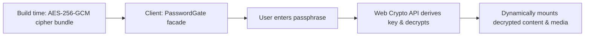

---
title: Organisms & Page Sections
createTime: 2026/09/01 01:55:00
permalink: /en/guide/api/components/organisms/
---

Organisms and page sections serve as the core feature containers for Shirone's standalone pages, integrating lower-level atoms, managing interactive states, and binding data sources.

---

## AnimeSection <Badge text="Hybrid SSR" color="#bc52ee" vertical="middle" /> <Badge text="Tab Filter" type="info" vertical="middle" />

**Path**: `src/components/organisms/AnimeSection.svelte`  
**Purpose**: Primary renderer for the anime page, consuming local data from `src/data/anime.ts` or Bangumi/Bilibili offline snapshots.

### Data Contract

```ts
interface AnimeItem {
  title: string;
  status: "watching" | "completed" | "planned" | "onHold" | "dropped";
  rating: number;
  cover?: string;
  description?: string;
  progress?: {
    watched: number;
    total: number;
  };
  year?: string;
  studio?: string;
  genres?: string[];
  link?: string;
}

interface AnimeSectionProps {
  items: AnimeItem[];
  defaultStatus?: string;
}
```

---

## MomentSection <Badge text="Astro SSR" color="#bc52ee" vertical="middle" /> <Badge text="Timeline" type="info" vertical="middle" />

**Path**: `src/components/organisms/MomentSection.svelte`  
**Purpose**: Micro-blogging moments stream supporting multi-image grids, full-screen lightbox viewing, and relative timestamp conversions.

### Data Contract

```ts
interface MomentItem {
  id: string;
  date: string | Date;
  content: string;
  images?: string[];
  tags?: string[];
  location?: string;
}

interface MomentSectionProps {
  moments: MomentItem[];
}
```

---

## FriendSection <Badge text="Astro SSR" color="#bc52ee" vertical="middle" /> <Badge text="Grid" type="info" vertical="middle" />

**Path**: `src/components/organisms/FriendSection.svelte`  
**Purpose**: Friends list grid with tag filtering, avatar error fallbacks, randomization, and secure external link attributes (`rel="noopener noreferrer"`).

### Data Contract

```ts
interface FriendItem {
  name: string;
  url: string;
  avatar: string;
  description: string;
  tags?: string[];
  color?: string;
}

interface FriendSectionProps {
  friends: FriendItem[];
  shuffle?: boolean;
}
```

---

## ProjectSection <Badge text="Astro SSR" color="#bc52ee" vertical="middle" /> <Badge text="Cards" type="info" vertical="middle" />

**Path**: `src/components/organisms/ProjectSection.svelte`  
**Purpose**: Project portfolio cards showing tech stack badges, GitHub Star counts, and live preview links.

### Data Contract

```ts
interface ProjectItem {
  name: string;
  description: string;
  link: string;
  preview?: string;
  icon?: string;
  techStack?: string[];
  stars?: number;
  featured?: boolean;
}

interface ProjectSectionProps {
  projects: ProjectItem[];
}
```

---

## SkillSection & DeviceSection <Badge text="Astro SSR" color="#bc52ee" vertical="middle" />

**Path**: `src/components/organisms/SkillSection.svelte` & `DeviceSection.svelte`  
**Purpose**:
- `SkillSection`: Proficiency bars and categorization cards for tech stacks.
- `DeviceSection`: Everyday gear, hardware setups, and user experience ratings.

---

## TimelineSection <Badge text="Astro SSR" color="#bc52ee" vertical="middle" /> <Badge text="Chronological" type="info" vertical="middle" />

**Path**: `src/components/organisms/TimelineSection.svelte`  
**Purpose**: Personal history and site milestone timeline with sticky year indicators.

---

## Content Encryption Suite

**Components**: `EncryptedContent.astro`, `PasswordGate.svelte`, `ProtectedPost.svelte`, `ProtectedAlbum.svelte`  
**Purpose**: Secure client-side decryption framework for protected posts and photo albums.

### Architecture Flow



- **Zero-Plaintext Guarantee**: Static HTML contains only Base64 ciphertext and IV; no decrypted content exists in the DOM until authenticated.
- **Session Persistence**: Authentication state can be safely retained within the current browser session.
