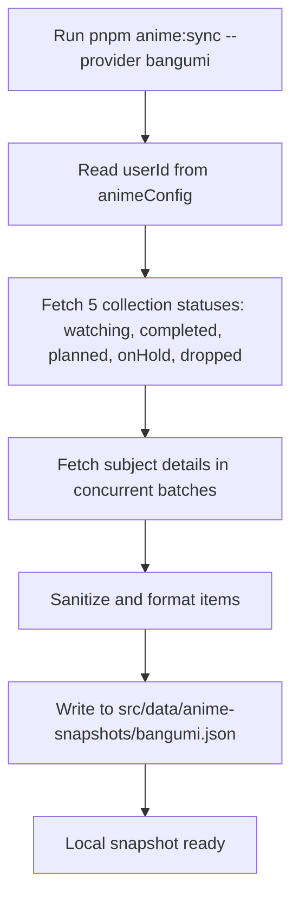

---
title: Bangumi API
createTime: 2026/09/01 01:05:00
permalink: /en/guide/api/user/bangumi/
---

Bangumi ([bgm.tv](https://bgm.tv/)) is an ACG database and community. Shirone's anime page utilizes the official Bangumi API v0 to synchronize anime watchlists and rich metadata.

Shirone adopts a **Dual-Plane Model**: external API requests occur exclusively during the explicit offline synchronization phase (`scripts/anime/providers/bangumi.mjs`), generating sanitized local JSON snapshots. The runtime page and production build consume this snapshot directly, **making zero requests to Bangumi during visitor browsing**.

## Configuration <Badge text="src/config/animeConfig.ts" type="info" vertical="middle" />

Configure the Bangumi provider in `src/config/animeConfig.ts`:

```ts title="src/config/animeConfig.ts"
export const animeConfig = withUserConfig("anime", {
  enable: true,
  source: {
    kind: "snapshot",
    provider: "bangumi",
  },
  fallback: {
    kind: "local", // fallback to src/data/anime.ts if snapshot fails
  },
  providers: {
    bangumi: {
      enable: true,
      userId: "sai", // Bangumi username or numeric UID
      request: {
        pageSize: 50,    // Items per page (10 ~ 100, default 50)
        maxItems: 300,   // Maximum synchronized entries
        minDelayMs: 200, // Delay between page requests in ms
      },
    },
  },
})
```

| Field | Type | Default | Description |
| --- | --- | --- | --- |
| `enable` | `boolean` | `false` | Whether to enable the Bangumi sync provider |
| `userId` | `string` | `""` | Your Bangumi username or numeric UID |
| `request.pageSize` | `number` | `50` | Number of entries per page request (10 ~ 100) |
| `request.maxItems` | `number` | `100` | Maximum total entries to fetch |
| `request.minDelayMs` | `number` | `200` | Delay between pagination requests in milliseconds to prevent rate limiting |

## API Endpoints Used

The Bangumi API base URL is `https://api.bgm.tv`. All requests include a compliant `User-Agent` header.

### 1. User Collection Endpoint

Fetches collections categorized by user watch status.

- **Endpoint**: `GET /v0/users/{userId}/collections`
- **Query Parameters**:

| Parameter | Type | Description |
| --- | --- | --- |
| `subject_type` | `number` | Fixed to `2` (Anime) |
| `type` | `number` | Status type: `1` Planned / `2` Completed / `3` Watching / `4` On Hold / `5` Dropped |
| `limit` | `number` | Items per page (default 50) |
| `offset` | `number` | Pagination offset |

- **Sample Response**:
```json
{
  "total": 42,
  "limit": 50,
  "offset": 0,
  "data": [
    {
      "subject_id": 308479,
      "subject_type": 2,
      "rate": 9,
      "type": 3,
      "ep_status": 12,
      "subject": {
        "id": 308479,
        "name": "Lycoris Recoil",
        "name_cn": "莉可丽丝",
        "short_summary": "Ordinary days, secret agendas...",
        "date": "2022-07-02",
        "images": {
          "large": "https://lain.bgm.tv/pic/cover/l/...",
          "medium": "https://lain.bgm.tv/pic/cover/m/..."
        },
        "eps": 13,
        "score": 8.1
      }
    }
  ]
}
```

### 2. Subject Details Endpoint

Shirone fetches detailed subject information in concurrency batches of 6.

- **Endpoint**: `GET /v0/subjects/{subjectId}`
- **Data Normalization**:
  - **Title priority**: Prefers `name_cn` (translated name), falling back to `name` (original title).
  - **Animation studio extraction**: Scans `infobox` keys for `动画制作`, `制作`, `製作`, `开发`, and `Animation Production`.
  - **Genres & tags**: Extracted from the `tags` array.
  - **Scores & progress**: Uses user personal rating `rate` (or community `score` as fallback) and episodes watched `ep_status`.

## Synchronization Workflow



Run the sync command:

```bash
pnpm anime:sync --provider bangumi
```

## Snapshot Artifacts & Content Separation

- **Snapshot file**: Stored under `src/data/anime-snapshots/bangumi.json`.
- **Zero-secret builds**: In dual-repo or CI architectures, snapshots can be committed to the content repository. Static builds need no external credentials or network access.

## FAQ

**HTTP 404 Not Found during sync**

Verify that your `userId` is correct. You can provide your custom Bangumi username (e.g. `sai`) or numeric UID. Private profiles cannot be queried via public endpoints.

**Rate limited by Bangumi (HTTP 429 Too Many Requests)**

Increase `request.minDelayMs` (e.g. to `500`) to introduce longer pauses between pagination batches.

**Studio name is missing on certain items**

Some community wiki entries on Bangumi do not have production company fields populated. Shirone handles missing fields gracefully without breaking the layout.
