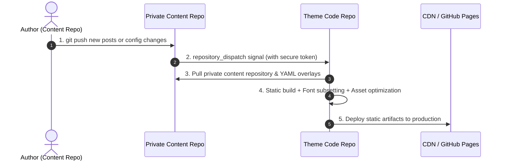

# Cross-Repo CI Automation

This is the officially recommended automated deployment architecture.

Whenever changes are pushed to your content repository, it sends a repository dispatch notification to the theme code repository. GitHub Actions in the theme repo automatically validates configs, slices Chinese fonts, builds static pages, and deploys to production.



---

## Core Configuration Steps

::: steps
1. **Generate GitHub Personal Access Token (PAT)**

   To allow the private content repository to trigger builds in the theme repository, create a token with repository dispatch permissions:

   - Go to GitHub -> Top-right Avatar -> **Settings** -> **Developer Settings**;
   - Select **Personal access tokens** -> **Fine-grained tokens**;
   - Click **Generate new token**;
   - **Repository access**: Select **Only select repositories**, and check your ==Theme Code Repository==;
   - **Permissions**: Under **Repository permissions**, find **Contents**, and set to ==Read and write=={.error};
   - Click **Generate token** and **copy it immediately**.

   

   > [!CAUTION] Keep Personal Access Token Secure
   > Tokens are shown only once. ==Never commit raw tokens to code files=={.error}; always store them in GitHub Encrypted Secrets.

2. **Configure Secret in Private Content Repository**

   - Navigate to your ==Private Content Repository==;
   - Click **Settings** -> **Secrets and variables** -> **Actions**;
   - Click **New repository secret**;
   - **Name**: ==DISPATCH_TOKEN=={.tip} (exact case match);
   - **Secret**: Paste the Personal Access Token;
   - Click **Add secret**.

   

3. **Add Trigger Workflow in Content Repository**

   Create `.github/workflows/trigger-build.yml` in your content repository:

   ```yaml title=".github/workflows/trigger-build.yml"
   name: Trigger Theme Build

   on:
     push:
       branches: [main]
     workflow_dispatch:

   jobs:
     dispatch:
       runs-on: ubuntu-latest
       steps:
         - name: Dispatch build event to theme repository
           uses: peter-evans/repository-dispatch@v3
           with:
             token: ${{ secrets.DISPATCH_TOKEN }} # [!code highlight]
             repository: YOUR_GITHUB_USERNAME/YOUR_THEME_REPO_NAME # [!code warning]
             event-type: content-update
   ```

4. **Configure Dispatch Receiver in Theme Repository**

   Create or update `.github/workflows/deploy.yml` in the theme repository:

   ```yaml title=".github/workflows/deploy.yml"
   name: Deploy Shirone Blog

   on:
     push:
       branches: [main]
     repository_dispatch:
       types: [content-update] # [!code highlight]
     workflow_dispatch:

   jobs:
     build-and-deploy:
       runs-on: ubuntu-latest
       steps:
         - name: Checkout Theme Repo
           uses: actions/checkout@v4

         - name: Setup Node.js & pnpm
           uses: pnpm/action-setup@v3
           with:
             version: 9

         - name: Setup Node
           uses: actions/setup-node@v4
           with:
             node-version: 20
             cache: "pnpm"

         - name: Install Dependencies
           run: pnpm install --frozen-lockfile

         - name: Pull Private Content & Build
           env:
             CONTENT_REPO_URL: "https://x-access-token:${{ secrets.CONTENT_ACCESS_TOKEN }}@github.com/${{ github.repository_owner }}/my-blog-content.git" # [!code highlight]
           run: |
             pnpm content:sync
             pnpm build

         - name: Deploy to GitHub Pages
           uses: peaceiris/actions-gh-pages@v4
           with:
             github_token: ${{ secrets.GITHUB_TOKEN }}
             publish_dir: ./dist
   ```
:::

---

## Verification

::: steps
1. Create or edit a Markdown post in your external content repository;
2. Run `git add .`, `git commit -m "docs: test dispatch"`, and `git push` to GitHub;
3. Open content repository **Actions** tab to confirm `Trigger Theme Build` ran successfully;
4. Open theme repository **Actions** tab to confirm `Deploy Shirone Blog` was dispatched.
:::

---

## Next Steps

- Head to [Deploy Hook Integrations](/en/guide/content-separation/deploy-hooks/): Learn Cloudflare Pages, Vercel, and EdgeOne integration patterns
