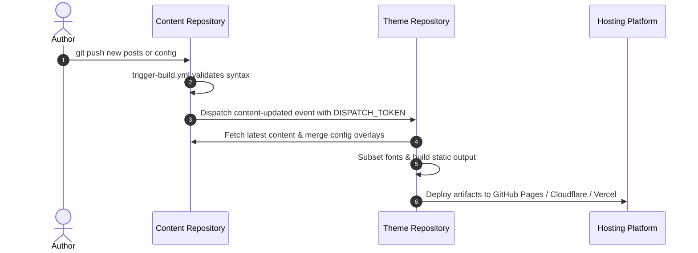

# Cross-Repo CI Dispatch

This is the recommended automated deployment workflow.

Each push to your content repository automatically notifies the theme code repository. GitHub Actions in the theme repo fetches your content, validates configuration, subsets fonts, builds static assets, and deploys online.



---

## Step 1: Create a GitHub Personal Access Token

1. **Go to Settings**: Click your avatar on GitHub and select Settings;

   

2. **Developer Settings**: Scroll down the left sidebar to Developer Settings;

   

   

3. **Fine-grained Tokens**: Click Personal access tokens -> Fine-grained tokens;

   

4. **Generate Token**: Click Generate new token;

   

5. **Configure Permissions**:
   - **Token name**: `DISPATCH_TOKEN`;
   - **Repository access**: Select **Only select repositories**, and choose your **theme code repository**;

     

   - **Permissions**: Under Repository permissions, find **Contents** and set it to **Read and write**;

     

6. **Copy Token**: Click Generate token and copy the string immediately.

   

---

## Step 2: Configure Secret in Content Repository

::: steps
1. **Enable Trigger Workflow**

   In your content repository, ensure `.github/workflows/trigger-build.yml` is enabled (ejected repositories enable this by default).

2. **Add DISPATCH_TOKEN Secret**

   - Go to your content repository's **Settings** -> **Secrets and variables** -> **Actions**;
   - Click **New repository secret**;
   - Set **Name** to `DISPATCH_TOKEN` (all uppercase);
   - Paste the token into **Secret** and click **Add secret**.
:::

---

## Step 3: Enable Deploy Workflow in Theme Repository

::: steps
1. **Rename Deploy Workflow**

   In your theme code repository, rename `.github/workflows/deploy.yml.example` to `deploy.yml`.

2. **Configure Content Repo Environment Variable**

   Edit the environment variable block:

   ```yaml
   env:
     CONTENT_REPOSITORY: YOUR_USERNAME/my-blog-content
     CONTENT_WORKING_COPY: .content-src
   ```

3. **Add Private Access Token (If Private Repo)**

   - Generate a token with read access to the private content repository;
   - In theme repo **Settings** -> **Secrets and variables** -> **Actions**, add a secret named `CONTENT_REPO_TOKEN` with the token value;
   - Commit and push to main.
:::

---

## Step 4: Verify Automation

Push a commit in your content repository:

```bash
git add .
git commit -m "feat: publish new article"
git push origin main
```

::: steps
1. **Check Content Repo Dispatch**

   Open the Actions tab in your content repository to confirm `Trigger Theme Build` succeeded.

2. **Monitor Theme Build**

   Open the Actions tab in your theme repository to verify automated pulling, font subsetting, and static site compilation.

3. **View Live Site**

   Refresh your live blog to see your newly published content.
:::

---

## Concurrency Control and Rollback

- **Concurrency Control**: Ongoing builds are automatically cancelled when a new push arrives (`cancel-in-progress: true`), preventing race conditions;
- **Zero-Code Emergency Rollback**: In your theme repo's Actions tab, trigger the Deploy workflow manually and specify any historical commit SHA in `content_ref` to rollback instantly.

---

## Next Steps

- Head to [Deploy Hooks on Cloud Platforms](/en/guide/content-separation/deploy-hooks/): Configure Cloudflare Pages, Vercel, and EdgeOne deploy hooks
