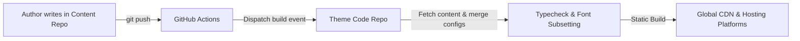

# Content Separation Overview

Shirone provides native support for a decoupled dual-repository architecture, allowing you to separate your personal blog content from the theme codebase into two independent Git repositories.

---

## Core Architecture Concepts

Think of your blog as a residential home:

- **Theme Code Repository**: Functions as the architectural foundation, plumbing, and electrical framework. It handles animations, color schemes, responsive layouts, image optimization, and build pipelines. It is publicly maintained and updated by theme authors;
- **Personal Content Repository**: Represents your personal furniture, photo albums, and journals. It contains all your posts, moments, photos, structured data entities, and configuration overrides. It is fully controlled by you and can be kept private.

In a traditional single-repository model, posts, photos, and theme source code are mixed together. When upgrading the theme, merging upstream changes often causes Git conflicts or accidentally exposes unpublished drafts.

Shirone resolves this by keeping your content in a private repository while the theme repository pulls and builds the site.

---

## Dual-Repository Workflow

The synchronization and build pipeline is driven by automation scripts:

1. **Write in Content Repo**: Write Markdown posts or adjust YAML configurations, then push to your content repository;
2. **Automated Pipeline Trigger**: Actions in the content repo dispatch a build signal to the theme repo, or hosting deploy hooks receive the update;
3. **Materialization & Config Merging**: The theme repo fetches the content and recursively merges YAML overrides with theme defaults;
4. **Compile & Deploy**: The theme repo subsets Chinese fonts, renders static HTML, optimizes assets, and deploys to hosting platforms.

---

## Key Benefits

### 1. Conflict-Free Theme Upgrades

Theme updates will not touch your personal content. When a new theme version is released, simply sync upstream commits in your theme repository without Git conflicts.

### 2. Private Content Protection

Keep your content repository private while leaving your theme code repository public. Unpublished drafts, personal photo albums, and private credentials remain secure.

### 3. Focused Authoring Experience

Authors do not need to deal with build tooling or package dependencies. Daily work focuses on:
- Writing Markdown articles and moments under `content/`;
- Editing lightweight YAML files under `config/`.

---

## Single vs Dual Repository Comparison

| Dimension | Default Single Repo | Decoupled Dual Repo |
| :--- | :--- | :--- |
| **Target Audience** | Beginners looking for a simple start | Long-term bloggers needing private drafts and seamless theme updates |
| **Repository Count** | 1 (Code and content mixed) | 2 (Public theme repo + Private content repo) |
| **Upgrade Cost** | Manual upstream merge with potential conflicts | Fast upstream pull with zero conflicts |
| **Privacy** | Drafts are exposed if the repo is public | Content repo is private; theme repo can be public |
| **Authoring Tools** | Inside the project workspace | Any external editor like Obsidian, VS Code, or Typora |
| **Setup Overhead** | Zero extra setup | One-time token or deploy hook configuration |

---

## Next Steps

- Head to [Initializing Private Content Repo](/en/guide/content-separation/init-repo/): Learn how to eject from an existing repo or clone from template
