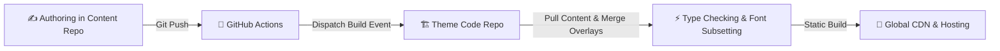

# Content Separation Overview

Shirone provides native support for decoupled content separation, allowing you to isolate the ==theme frontend engine== and your ==personal content repository== into two independent Git repositories.

---

## Core Concepts

Think of a personal blog as a residence:

- **Theme Code Repository**: The architectural framework, plumbing, electrical grid, and rendering pipeline: responsible for UI animations, dark mode, responsive layout, image optimization, and static building—maintained and ==continuously upgraded upstream==;
- **Personal Content Repository**: The furniture, family photo albums, books, and diary entries: contains all your posts, moments, album photos, data entities, and configuration overlays—under your ==complete ownership and kept private=={.tip}.

In traditional monolithic repositories, posts, media assets, and theme source code are tightly coupled. Upstream updates frequently trigger painful Git merge conflicts, or inadvertently publish private drafts to public repositories.

Shirone's content separation architecture eliminates these pain points: your content is securely housed in a ==private content repository==, while the theme code repository simply pulls content during builds.

> [!TIP] Core Value of Dual-Repo Setup
> By decoupling content from theme mechanics, you can author posts and configure your site like using a lightweight headless CMS while seamlessly syncing upstream theme enhancements.

---

## Dual-Repo Architecture & Automation Pipeline

The synchronization, config merge, and release workflow is fully automated:

::: steps
1. **Authoring in Content Repo**

   Draft posts or update YAML configs in your favorite Markdown editor, then push to your private repository.

2. **Automated Pipeline Trigger**

   A lightweight GitHub Actions workflow sends a ==dispatch event== to the theme repository, or a cloud deploy hook captures the push.

3. **Content Materialization & Config Overlay**

   The theme repository pulls the content payload and executes ==recursive deep merge== between YAML overlays and theme defaults.

4. **Build & Global Deployment**

   The theme repository performs Chinese font subsetting, static page generation, asset compression, and deploys to global CDNs.
:::

---

## Key Advantages

### 1. Conflict-Free Theme Upgrades

Open-source themes evolve rapidly with new features and bug fixes. Under content separation, your posts, albums, and custom configs reside outside the theme repository. Syncing upstream releases yields ==zero Git merge conflicts=={.tip}.

### 2. Safeguard Private Content & Drafts

Many authors wish to keep their theme repository open-source while keeping:
- Unfinished drafts and private journals;
- Family albums and high-res photography;
- Private analytics tokens or unpublished metadata.

With dual repos, you can set your ==content repository to Private=={.tip} and your ==theme repository to Public==, enjoying the open-source ecosystem without exposing sensitive data.

> [!IMPORTANT] Privacy Isolation
> Storing posts in a private repository ensures that even if your theme repository is completely open-source, your drafts and media assets remain strictly confidential.

### 3. Lightweight Authoring Experience

Authors do not need to install complex Node.js dependencies, build tooling, or bundlers on their writing devices. Simply focus on:
- Authoring Markdown posts and microblogs inside `content/`;
- Tweaking lightweight YAML configs inside `config/`.

---

## Monolithic vs Dual-Repo Comparison

| Metric | Monolithic Setup <Badge text="Starter" type="info" /> | Content Separation <Badge text="Recommended" type="tip" /> |
| :--- | :--- | :--- |
| **Target Audience** | Beginners seeking single-repository simplicity | Long-term bloggers needing private drafts and seamless theme updates |
| **Repo Count** | 1 (Code and content coupled) | 2 (Public theme repo + Private content repo) |
| **Upgrade Friction** | Manual upstream merge with potential Git conflicts | Direct upstream pull with ==zero merge conflicts== |
| **Privacy** | Drafts exposed if repository is open-sourced | ==Content repo completely private=={.tip}, theme repo safely public |
| **Writing Tools** | Must run within the theme project | Independent editing with Obsidian, VS Code, Typora |
| **Onboarding** | Zero setup, clone and run | One-time setup for access token or deploy hook |

---

## Next Steps

- Head to [Initializing Private Content Repo](/en/guide/content-separation/init-repo/): Learn one-click eject and template initialization
