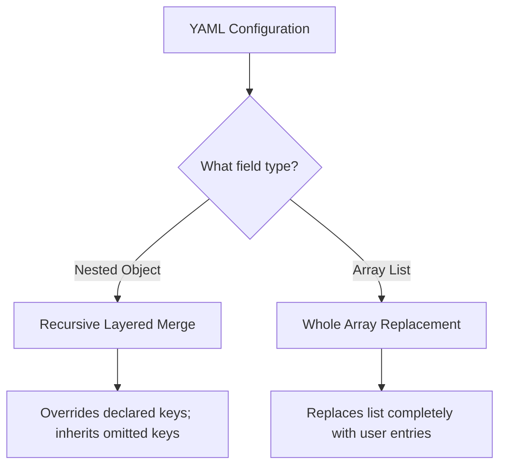

# Configuration Overlay Principles

In Shirone, site-wide configuration uses a **declarative overlay mechanism**. You do not need to modify core theme code. Simply place YAML configuration files in your content repository's `config/` directory to customize your site.

---

## Core Design Principles

### 1. Minimal Override Principle
In YAML files, you **only declare the keys you want to customize**. Any omitted fields automatically inherit theme defaults.

- **Clean Config Files**: No need to maintain thousands of lines of default configurations;
- **Smooth Theme Upgrades**: When new features or updated defaults are added in new theme releases, your site inherits them automatically.

### 2. Object Merging vs. Array Replacement



- **Nested Objects (Recursive Merge)**:
  In `site.yaml`, if you only want to customize the typewriter speed for the banner, write:
  ```yaml
  banner:
    homeText:
      typewriter:
        speed: 150
  ```
  All other carousel and banner settings are preserved from theme defaults.

- **Array Lists (Whole Replacement)**:
  Arrays (e.g. `nav-bar.yaml` links, `sidebar.yaml` component lists, `profile.yaml` social links) follow a **whole array replacement** rule. You must specify the complete set of items you wish to display.

---

## Type Safety and Intelligent Suggestions

During `pnpm content:validate` or `pnpm content:sync`, the system parses YAML files and validates them against TypeScript definitions. Typos are caught immediately with actionable suggestions:

```text
  config/site.yaml's banner.homeText: Type '{ titel: string }' is not assignable to type 'DeepPartial<HomeTextConfig>'
    Did you mean "title"?
```

---

## Configuration File Reference

All files reside in `config/` inside the content repository:

| File | Domain Area | Merge Rule |
| :--- | :--- | :--- |
| `config/site.yaml` | Site identity, banners, typewriter, background textures | Object recursive merge |
| `config/profile.yaml` | Avatar, nickname, bio, social links | Object merge (`links` replaced) |
| `config/nav-bar.yaml` | Navigation items, presets, dropdowns | Array whole replacement |
| `config/sidebar.yaml` | Sidebar layout and widgets | Object merge (`components` replaced) |
| `config/font.yaml` | Font families and subsetting rules | Object merge (`fontFamilies` replaced) |
| `config/anime.yaml` | Anime tracking and sync providers | Object recursive merge |
| `config/music.yaml` | Music player modes and playlist sources | Object recursive merge |
| `config/comment.yaml` | Comment provider settings (Twikoo) | Object recursive merge |
| `config/context-menu.yaml` | Right-click context menu actions | Object merge (`actions` replaced) |
| `config/post-list.yaml` | Pagination and post list layouts | Object recursive merge |
| `config/article.yaml` | Reading time, outdated alerts, poster sharing | Object recursive merge |
| `config/llms.yaml` | LLM endpoints and summaries (/llms.txt) | Object merge (`corePages` replaced) |
| `config/umami.yaml` | Umami analytics integration | Object recursive merge |
| `config/footer.yaml` | Custom footer injection toggle | Object recursive merge |
| `config/footer.html` | Custom footer raw HTML | Direct file mapping |

---

## Navigation Bar Rules: `config/nav-bar.yaml`

Three declaration patterns are supported:

- **1. Preset Reference**:
  ```yaml
  - preset: Home
  - preset: Archive
  - preset: Moments
  ```
- **2. Preset with Partial Override**:
  ```yaml
  - preset: GitHub
    url: https://github.com/your-username/your-repo
  ```
- **3. Custom Menu with Sub-menus**:
  ```yaml
  - name: Guestbook
    url: /guestbook/
    icon: material-symbols:chat-outline-rounded
  - name: $t:more
    icon: material-symbols:apps-rounded
    children:
      - preset: Timeline
      - preset: Projects
      - preset: Skills
      - preset: About
  ```

---

## Next Steps

- Head to [Cross-Repo CI Dispatch](/en/guide/content-separation/ci-dispatch/): Configure GitHub Actions cross-repository build pipelines
