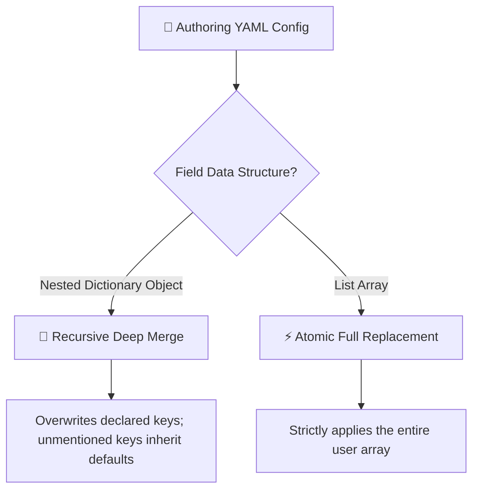

# Config Overlay Principles

In Shirone, all site configurations use a ==declarative overlay architecture==. You do not need to touch the theme engine core code. Simply create YAML files in your content repository's `config/` directory to customize any site behavior.

---

## Core Design Principles

### 1. Minimal Overlay Principle <Badge text="Clean" type="tip" />
In YAML files, you ==only need to declare fields you wish to customize=={.tip}. All unmentioned properties automatically inherit theme defaults.

Key benefits:
- **Clean Configuration**: No need to maintain thousands of lines of default boilerplate;
- **Seamless Upgrades**: When upstream introduces new features or refines defaults, your site inherits them automatically.

### 2. Object Merge vs Array Replacement

When parsing YAML configurations, two distinct merging rules apply:



#### Nested Objects (Recursive Deep Merge)
For instance, in `site.yaml`, if you only wish to adjust typewriter typing speed:

```yaml title="config/site.yaml"
banner:
  homeText:
    typewriter:
      speed: 150 # [!code highlight]
```

Deletion speed, pause delays, and wallpaper sliders automatically inherit upstream defaults.

#### List Arrays (Atomic Full Replacement)
All array structures (such as `nav-bar.yaml`, `sidebar.yaml` components, `profile.links`, `site.favicon`) use ==atomic full replacement=={.error}.

> [!WARNING] Array Full Replacement Rule
> Array order and member composition represent a cohesive whole. Partial patching causes ordering ambiguities.
> When configuring arrays, ==you must enumerate the complete list of items you wish to render=={.error}.

---

## Typo Safety & Auto Compilation

### 1. Intelligent Typo Suggestions

Shirone incorporates compile-time schema validation. When running `pnpm content:validate` or syncing content, mistakes are flagged instantly:

```text title="Terminal Typo Suggestion"
  config/site.yaml's banner.homeText: Type '{ titel: string }' is not assignable to type 'DeepPartial<HomeTextConfig>'
    Did you mean "title"? // [!code highlight]
```

### 2. Automated Bridge Module Compilation

During sync (`pnpm content:sync`) or production build, all YAML files are compiled into `src/user/user-config.ts`:

::: steps
1. **Icon Offline Bundling**

   Scans declared icons and bundles them into local assets, eliminating external CDN icon requests.

2. **Font Subsetting Extraction**

   Extracts site titles, author names, and descriptions to feed the Chinese font subsetting engine.

3. **Zero Maintenance**

   The bridge file is regenerated on every sync; never edit it manually.
:::

---

## Configuration Quick Reference

All config files reside under `config/` in your content repository:

| File Path | Functional Domain | Default Strategy |
| :--- | :--- | :--- |
| `config/site.yaml` | Site identity, timezone, banner wallpaper, typewriter | Recursive Object Merge |
| `config/profile.yaml` | Avatar, bio, and social links | Object Merge (`links` Array Replacement) |
| `config/nav-bar.yaml` | Top navigation items and dropdowns | ==Array Replacement== |
| `config/sidebar.yaml` | Single/dual column layout and widgets | Object Merge (`components` Array Replacement) |
| `config/font.yaml` | Web fonts and subsetting rules | Object Merge (`fontFamilies` Array Replacement) |
| `config/anime.yaml` | Anime sync sources and Bangumi config | Recursive Object Merge |
| `config/music.yaml` | Sidebar music player modes and playlist | Recursive Object Merge |
| `config/comment.yaml` | Comment providers and Twikoo settings | Recursive Object Merge |
| `config/context-menu.yaml` | Desktop right-click context menu actions | Object Merge (`actions` Array Replacement) |
| `config/post-list.yaml` | Post pagination and card grid layout | Recursive Object Merge |
| `config/article.yaml` | Reading time, outdated alerts, recommendations | Recursive Object Merge |
| `config/devices.yaml` | Hardware device showcase categories | Object Merge (`categories` Array Replacement) |
| `config/projects.yaml` | Open source project categories | Object Merge (`categories` Array Replacement) |
| `config/skills.yaml` | Skill graph categories | Object Merge (`categories` Array Replacement) |
| `config/timeline.yaml` | Milestones timeline categories | Object Merge (`categories` Array Replacement) |
| `config/friends.yaml` | Friend links grouping and health check | Object Merge (`groups` Array Replacement) |

---

## Common Configuration Examples

### Example 1: Customize Site Title & Banner

```yaml title="config/site.yaml"
# Only declare fields you want to change
title: "My Tech Notes" # [!code ++]
description: "Exploring programming and design" # [!code ++]
favicon: "/favicon.ico"

banner:
  enable: true
  homeText:
    title: "Hello World"
    subtitle: "Beauty in Simplicity"
    typewriter:
      enable: true
      speed: 120
```

### Example 2: Customize Sidebar Widgets

```yaml title="config/sidebar.yaml"
layout: "two-column"
sticky: "toc"

# Array full replacement: renders only these 4 widgets
components: # [!code highlight]
  - "profile"
  - "toc"
  - "recent-posts"
  - "tags"
```

---

## Next Steps

- Head to [Cross-Repo CI Automation](/en/guide/content-separation/ci-dispatch/): Set up GitHub Actions for cross-repository automated builds
