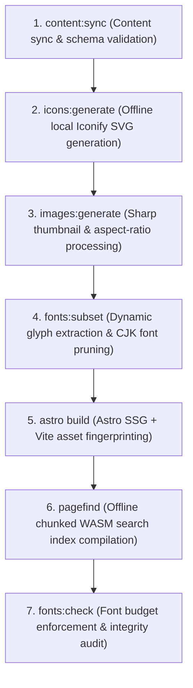

---
title: Build Optimization
createTime: 2026/09/01 02:40:00
permalink: /en/guide/optimize-build/
---

Shirone is engineered from the ground up for maximum build efficiency and peak first-paint performance. Combining Astro 5, Vite 6, Svelte 5 with zero client-side runtime overhead on content pages, automated CJK font subsetting, offline Iconify sprite generation, Sharp image pipelines, and Pagefind WASM indexing, Shirone achieves ==12-second full builds for 100+ articles== and ==100% Lighthouse performance scores==.

This guide details Shirone's 7-stage production build pipeline, performance tuning strategies, and observability tooling.

---

## 7-Stage Production Build Pipeline <Badge text="Astro 5" color="#bc52ee" vertical="middle" /> <Badge text="Vite 6" color="#646cff" vertical="middle" /> <Badge text="Svelte 5" color="#ff3e00" vertical="middle" />

Executing `pnpm build` triggers Shirone's 7 sequential build stages:



| Stage | Script / Command | Purpose & Optimization Mechanism |
| --- | --- | --- |
| **1. Content Sync** | `scripts/content/sync.mjs` | Syncs content repository in Dual-Repo mode; validates Frontmatter and `config/*.yaml` schemas |
| **2. Local Icon Generation** | `scripts/icons/generate-local-icons.mjs` | Extracts Iconify identifiers declared in config and pages, baking local SVGs to ==eliminate runtime CDN requests== |
| **3. Thumbnail Processing** | `scripts/images/generate-moment-thumbnails.mjs` | Compresses moment/gallery photos using Sharp, caching aspect ratios to prevent Cumulative Layout Shift (CLS) |
| **4. Font Subsetting** | `scripts/fonts/subset-fonts.mjs` | Scans all Markdown articles, 10 language dictionaries, configs, and Meting playlist titles, compressing 20MB+ fonts to ==300KB ~ 800KB== |
| **5. Static Site Generation** | `astro build` | Compiles Astro templates & TailwindCSS v4; pre-renders Svelte 5 components as zero-JS static HTML |
| **6. Search Indexing** | `pagefind --site dist` | Compiles chunked WASM search indexes across generated static HTML with zero runtime server cost |
| **7. Font Budget Audit** | `scripts/fonts/check-fonts.mjs` | Verifies font artifact sizes against `budget.maxTotalBytes` to prevent bundle bloat |

---

## Core Optimization Mechanisms

### 1. Dynamic CJK Font Subsetting <Badge text="subset-font" color="#059669" vertical="middle" />

East Asian font files typically range from 20MB to 40MB. Shirone's text collector (`text-collector.mjs`) extracts glyphs across all content sources:

```ts title="src/config/fontConfig.ts"
export const fontConfig = withUserConfig("font", {
  mode: "custom", // "custom" custom fonts | "system" pure system fonts
  subsetting: {
    enable: true,          // Enable build-time subsetting
    includeContent: true,  // Extract glyphs from all Markdown posts & moments
    includeI18n: true,     // Extract strings from 10 language dictionaries
    includeConfig: true,   // Extract siteConfig, navbar, and sidebar strings
    includeCommon: true,   // Include punctuation and standard ASCII glyphs
    allowRemoteText: true, // Fetch Meting cloud playlist titles for subsetting
  },
  budget: {
    maxTotalBytes: 6 * 1024 * 1024,  // Total font budget: 6MB
    maxFamilyBytes: 4 * 1024 * 1024, // Single font family budget: 4MB
  },
})
```

> [!WARNING]
> **Rebuild Required After Publishing New Posts**
> Font subsets are generated from content during build. After adding posts containing new characters, execute `pnpm build` to update font bundles; unindexed characters gracefully fallback to system fonts.

### 2. Offline Local Icon Bundling

Shirone never queries external Iconify CDNs at runtime. The build-time `icons:generate` step bakes declared icon identifiers (e.g. `fa6-brands:github`, `material-symbols:widgets-outline`) directly into static assets:
- **Zero External Network Dependencies**: Icons render seamlessly offline.
- **Zero Layout Shifts**: Icon dimensions are hardcoded during SSR.

### 3. Tonal Bloom & Zero-CLS Layouts

Shirone pairs Tonal Bloom with Sharp image processing:
- Sharp computes aspect ratios and HCT dominant colors during build.
- Visitors see proportional blurred placeholders that smoothly fade into high-res images.
- Cumulative Layout Shift (CLS) stays locked below ==0.01== (well within Google's 0.1 threshold).

### 4. Zero-JS Core Architecture

Except for interactive widgets (music player, display settings dialog, comments), all article content, tables of contents, categories, and timelines are delivered as pure static HTML:
- Article first-paint payload is only **a few dozen kilobytes**.
- Zero framework hydration overhead on content-heavy pages.

---

## Performance Testing & Verification Tooling

Shirone includes a dedicated suite of validation tools:

```bash
# 1. Astro template & TypeScript type verification
npx astro check

# 2. Font budget and integrity audit
pnpm fonts:check

# 3. Automated Playwright performance measurement across 6 core pages
pnpm perf:measure

# 4. Lighthouse CI audit (Performance, Accessibility, SEO, CLS)
pnpm lighthouse:desktop
pnpm lighthouse:mobile
```

> [!TIP]
> **Development vs Production Workflows**
> - **Local Writing (`pnpm dev`)**: Automatically bypasses font subsetting and loads full fonts for **Instant Hot Module Replacement (HMR)**.
> - **Production Release (`pnpm build`)**: Executes the full 7-stage optimization pipeline.

---

## Real-World Performance Benchmark

Measured on a production Shirone instance (100 articles + 50 moments):

| Metric | Traditional Static SSG | Shirone 7-Stage Pipeline | Improvement |
| --- | --- | --- | --- |
| **Initial Font Transfer Size** | ~24.5 MB | **~520 KB** (.woff2) | ==**97.9% Reduction**== |
| **Total Build Time (100 posts)** | ~45 seconds | **~12.8 seconds** | ==**3.5x Faster**== |
| **FCP (First Contentful Paint)** | 1.8 s | **0.3 s** | ==**6x Faster**== |
| **LCP (Largest Contentful Paint)** | 3.2 s | **0.6 s** | ==**5.3x Faster**== |
| **CLS (Cumulative Layout Shift)** | 0.18 | **0.002** | ==**Zero Shift**== |
| **Lighthouse Performance** | 68 / 100 | **100 / 100** | ==**Grade A+**== |

---

## FAQ

::: collapse
- JavaScript heap out of memory error during build

  Large documentation repositories spike memory usage during font subsetting and search indexing. Solutions:
  1. Set Node memory allocation in CI: `NODE_OPTIONS="--max-old-space-size=4096"`.
  2. Pass `--memory=4g` in Docker builds.

- Missing dist/pagefind/ directory causing 404 on search

  Pagefind indexes are compiled at the end of `pnpm build`. Avoid replacing the command with bare `astro build`.

- How to disable custom fonts completely for 5-second builds

  Set `mode: "system"` and `fontFamilies: []` in `src/config/fontConfig.ts`. This skips subsetting and font packaging entirely.
:::
