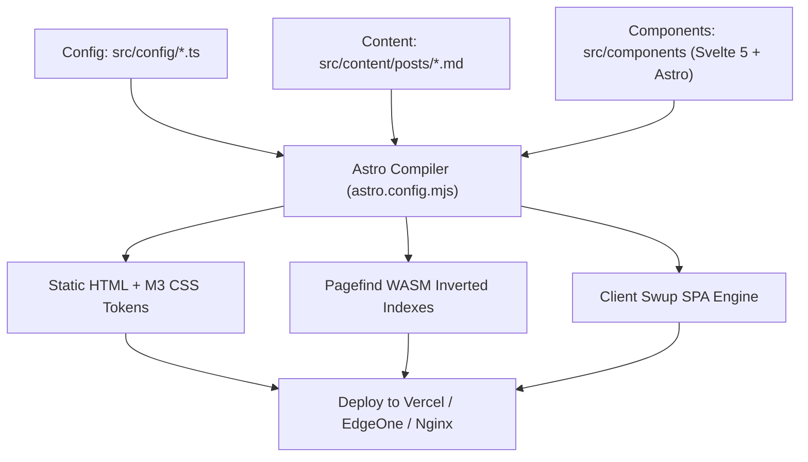

Shirone is a high-performance modern static blog system powered by **Astro 5 + Svelte 5 + Tailwind CSS + TypeScript**. The project strictly adheres to **Separation of Concerns (SoC)** and **Atomic Design principles**, featuring clear modular boundaries and strongly-typed configuration contracts.

This article explores Shirone's architectural skeleton and component interactions using interactive file trees, code trees, and visual workflows.

---

## Root Directory Architecture

The repository root contains public assets, build tooling configurations, automated scripts, and core source code:

::: file-tree title="Shirone Project Root"
- public/ # Pure static assets (favicon, custom fonts, robots.txt, etc.)
  - favicon.svg # Main website icon
  - fonts/ # Locally hosted web font subsets
- src/ # Core source code
  - assets/ # Processed static assets (default banners, illustrations)
  - components/ # Svelte 5 atomic components & Astro sections
  - config/ # Strongly-typed site configuration modules
  - content/ # Markdown articles and data collections
  - layouts/ # Top-level page wrappers (MainLayout, PostLayout)
  - pages/ # File-based routing & dynamic page generators
  - styles/ # M3 Expressive Design Tokens & global stylesheets
  - utils/ # Algorithm utilities (WebCrypto, color palette, audio singleton)
- scripts/ # Build automation and offline data sync scripts
  - sync-bangumi.ts # Bangumi anime collection sync
  - sync-bilibili.ts # Bilibili anime collection sync
- astro.config.mjs # Top-level Astro configuration (Svelte, Swup, Tailwind)
- svelte.config.js # Svelte 5 compiler settings (Runes reactivity)
- tsconfig.json # TypeScript strict path aliases
- package.json # Project dependencies and script shortcuts
- pnpm-lock.yaml # Pnpm lockfile
:::

---

## Source Layering & Modules (`src/`)

The `src/` directory is decomposed into seven functional domains:

```file-tree title="src Directory Breakdown"
src/
├── components/           # UI Component Library
│   ├── atoms/            # M3E Atomic UI (Button, Chip, TextField, Switch)
│   ├── blog/             # Blog-specific atoms (PostCard, TocList, PostMeta)
│   ├── organisms/        # Composite Organisms (AnimeSection, MomentSection, PasswordGate)
│   └── shell/            # Global Shell Widgets (TopAppBar, SideBar, MusicSidebar, FAB)
├── config/               # Centralized Strongly-Typed Configs
│   ├── siteConfig.ts     # Site metadata & profile information
│   ├── sidebarConfig.ts  # Sidebar widget arrangement & priorities
│   ├── navConfig.ts      # Top navigation hierarchy
│   ├── musicConfig.ts    # Music player sources & Meting configs
│   └── animeConfig.ts    # Anime collection sync settings
├── content/              # Content Layer
│   ├── posts/            # Blog posts (Folder mode & Single-file mode)
│   ├── moments/          # Microblogging moments
│   ├── friends/          # Friendly blog links
│   └── config.ts         # Astro Content Collections Zod Schema validation
├── layouts/              # Skeleton Layouts
│   ├── MainLayout.astro  # Root HTML shell, SEO tags, Swup containers, M3 theme injection
│   └── PostLayout.astro  # Article reading layout (TOC + Comments + Copyright)
├── pages/                # File-system Routing
│   ├── index.astro       # Home page (Hero banner + post feed)
│   ├── posts/            # Dynamic article routes
│   └── [slug].astro      # Standalone pages (about, anime, friends, projects...)
├── styles/               # Design System
│   ├── tokens.css        # Material 3 Expressive color & surface tokens
│   ├── typography.css    # Typography scales and responsive font sizing
│   └── animation.css     # Spring easing transitions & page motions
└── utils/                # Utility Modules
    ├── crypto.ts         # Web Crypto API AES-256-GCM client encryption/decryption
    ├── color.ts          # Wallpaper color extraction via Material Color Utilities
    └── music/            # Global background audio player singleton runtime
```

---

## Configuration-Driven Architecture

Shirone uses a strongly-typed configuration model. All feature toggles, author profiles, and widget placements are centralized under `src/config/`:

::: code-tree title="Configuration Driven Modules" entry="src/config/siteConfig.ts"

```ts title="src/config/siteConfig.ts"
import { withUserConfig } from "../utils/config";

export const siteConfig = withUserConfig("site", {
  title: "Shirone",
  subtitle: "Seeing the world from scratch",
  description: "Modern static blog powered by Astro 5 + Svelte 5",
  author: "Matsuzaka Yuki",
  avatar: "/avatar.webp",
  favicon: "/favicon.svg",
  themeColor: "#6750a4", // Material 3 Seed Color
  enableSwup: true,       // SPA smooth page transitions
  enablePagefind: true,   // WASM local full-text search
});
```

```ts title="src/config/sidebarConfig.ts"
import { withUserConfig } from "../utils/config";

export const sidebarConfig = withUserConfig("sidebar", {
  position: "left", // "left" | "right" | "none"
  widgets: [
    { type: "profile", enable: true },
    { type: "announcement", enable: true },
    { type: "music", enable: true, sticky: true },
    { type: "tags", enable: true, maxCount: 20 },
    { type: "categories", enable: true },
  ],
});
```

```ts title="src/config/musicConfig.ts"
import { withUserConfig } from "../utils/config";

export const musicConfig = withUserConfig("music", {
  enable: true,
  provider: "mixed", // "local" | "meting" | "custom" | "mixed"
  meting: {
    server: "netease",
    type: "playlist",
    id: "14164869977",
  },
  defaultVolume: 0.7,
  defaultMode: "sequence",
});
```

:::

---

## Content Organization Strategies (`src/content/posts/`)

Shirone supports two post organization strategies that can be freely mixed in a single repository:

::: tabs
@tab Folder Mode (Recommended)
```file-tree title="Folder Organization (Recommended)"
src/content/posts/
├── 2026-09-01-shirone-architecture/
│   ├── index.md        # Post content
│   ├── cover.webp      # Featured hero image (relative path)
│   ├── diagram.png     # Inline illustrations
│   └── snippet.ts      # Companion code attachments
└── 2026-09-02-webcrypto-guide/
    ├── index.md
    └── demo.mp4
```
- **Self-Contained**: Media, code snippets, and assets reside right next to the post.
- **Relative Path Referencing**: Use straightforward relative paths like `./cover.webp` or `./diagram.png`.

@tab Single File Mode
```file-tree title="Single File Organization"
src/content/posts/
├── 2026-08-31-hello-world.md
├── 2026-09-01-material-design-3.md
└── 2026-09-02-typescript-tips.md
```
- **Lightweight & Flat**: Ideal for text-only essays or articles utilizing cloud image hosting / CDN URLs.
:::

---

## Build Output Artifacts (`dist/`)

Running `pnpm build` compiles the codebase into pure static artifacts ready for instant edge deployment:

```file-tree title="dist Build Output"
dist/
├── _astro/               # Compiled JS/CSS asset chunks (with content hashing)
│   ├── Button.xxxx.js
│   └── style.xxxx.css
├── pagefind/             # Static WASM Pagefind search indexes
│   ├── pagefind.js
│   └── pagefind-ui.js
├── posts/                # Pre-rendered HTML post pages
│   └── my-post/
│       └── index.html
├── rss.xml               # RSS 2.0 Feed
├── atom.xml              # Atom 1.0 Feed
├── sitemap-index.xml     # SEO Sitemap index
├── llms.txt              # LLM-friendly documentation summary
└── index.html            # Site homepage
```

---

## Architecture Interaction Workflow



::: tip Key Architectural Strengths
1. **Instant First-Contentful Paint (FCP)**: Articles are pre-rendered into static HTML on the server with **Zero Client-Side JavaScript footprint** for reading.
2. **Progressive Hydration**: Interactive widgets (music player, modals, settings) hydrate on-demand via Svelte 5 Runes (`client:idle` / `client:visible`).
3. **Seamless Navigation**: Swup client runtime intercepts page navigations, providing an app-like SPA feel with smooth Material 3 transition curves.
:::