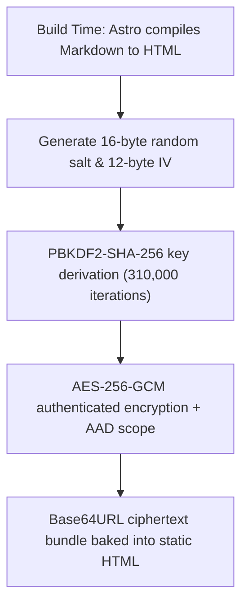
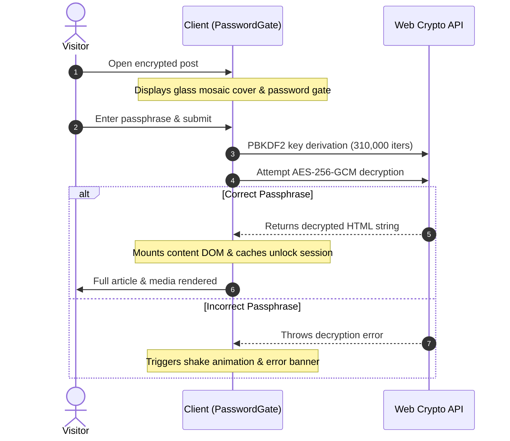

---
title: Client-Side Article Encryption
createTime: 2026/09/01 02:20:00
permalink: /en/guide/writing/advanced/encryption/
---

Shirone provides a robust article encryption system powered by the modern **Web Crypto API**. In a zero-backend static blog architecture, it delivers strong cryptographic protection for private essays, personal journals, and sensitive engineering notes.

---

## Cryptographic Standards & Architecture

Shirone's encryption is built on industry-standard cryptographic specifications:



- **Authenticated Encryption**: **AES-256-GCM** ensures confidentiality while preventing ciphertext tampering.
- **Key Derivation Function (KDF)**: **PBKDF2-SHA-256** with **310,000 iterations** (aligned with OWASP recommendations) to withstand offline rainbow table attacks and GPU-accelerated brute forcing.
- **Scope Integrity (AAD)**: Ciphertexts are cryptographically bound to `shirone-protected-content:1:${slug}` to eliminate cross-post replay vulnerabilities.
- **Zero Plaintext Leakage**: Build artifacts contain only ciphertext and public salt/IV parameters—**no plaintext passwords or content are ever bundled**.

---

## Frontmatter Configuration

Enable encryption in your post's frontmatter:

```markdown title="src/content/posts/my-encrypted-post.md"
---
title: Private Engineering Journal
published: 2026-09-01
description: Documenting architecture internals for unreleased features.
category: Private
tags: [Security, Architecture]
image: ./cover.webp

# Encryption Settings
encrypted: true
password: "your-super-secret-password"
passwordHint: "Favorite anime series title"
hideHomeContent: true
---

# Protected Post Content

Congratulations on entering the correct passphrase! Everything here is decrypted client-side...
```

### Fields Reference

| Field | Type | Required | Default | Description |
| --- | --- | --- | --- | --- |
| `encrypted` | `boolean` | No | `false` | Explicitly marks the post as encrypted |
| `password` | `string` | **Yes** | `""` | Passphrase required to unlock the post |
| `passwordHint` | `string` | No | `""` | Optional hint displayed under the password input field |
| `hideHomeContent` | `boolean` | No | `false` | When `true`, replaces card excerpts with a secure placeholder string |

---

## Unlock Flow (`PasswordGate`)

When visitors navigate to an encrypted page:



---

## Key Security Features

### 1. Fail-Closed Security Guarantee

If a post sets `encrypted: true` but omits or leaves the `password` field empty, the Shirone build engine **fails immediately and aborts the build**:

```text
Error: Encrypted posts require a non-empty password
```

This prevents accidental publication of private content in plaintext due to configuration typos.

### 2. RSS Feed Sanitization

Shirone automatically sanitizes encrypted posts in generated RSS/Atom feeds:
- Titles are prepended with `🔒`.
- Content and descriptions are replaced with a secure notice: `This post is password-protected. Please visit the website to decrypt.`
- Zero plaintext leaks to external RSS readers.

### 3. Session Unlock Persistence

Once successfully unlocked, the decrypted state is securely remembered in the browser session. Readers can navigate across the site and return without re-entering their password.
