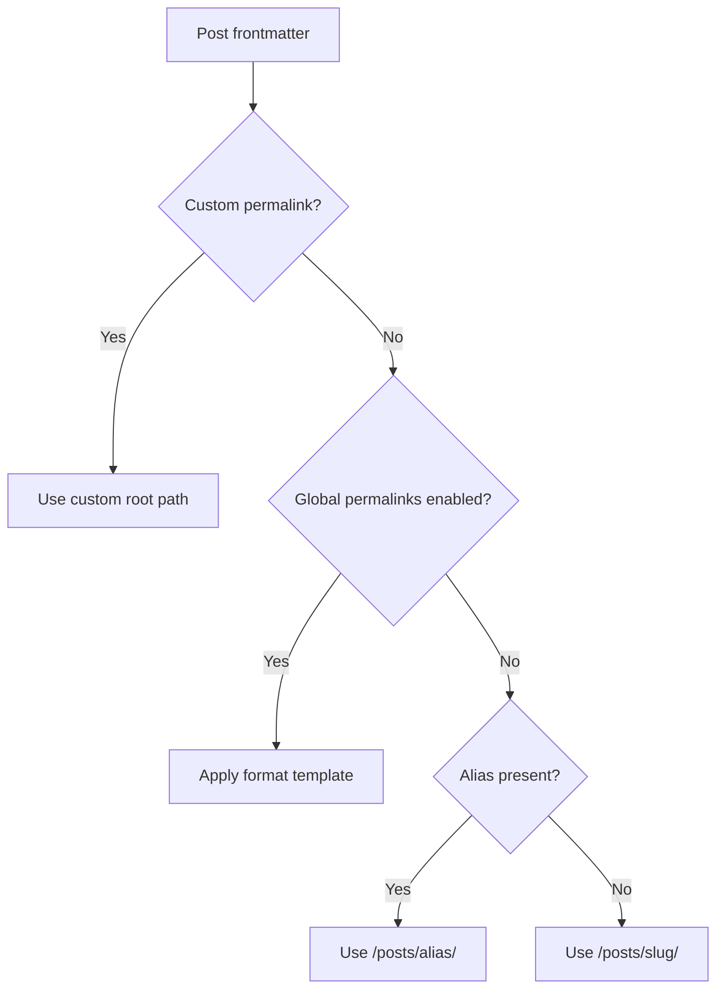

Permalinks control the public URL of a post. By default, Shirone derives a route at `/posts/<slug>/` from its file name. A global permalink template can instead organize URLs by date, category, or post number, while an individual post can always declare a fully custom address.

---

## Configure Global Permalinks <Badge text="config/permalink.yaml" type="info" vertical="middle" />

Create `config/permalink.yaml` in the content repository. It declaratively overlays the theme defaults, so `src/config/permalinkConfig.ts` does not need to be edited.

```yaml title="config/permalink.yaml"
enable: true
format: "%year%/%monthnum%/%day%/%postname%"
```

For example, `src/content/posts/hello-shirone.md` resolves to a path such as `/2026/09/01/hello-shirone/`.

> [!TIP]
> **Default behavior**
> `enable` defaults to `false` and `format` defaults to `%postname%`. When the feature is disabled, posts continue to use `/posts/<slug>/`; `hello-shirone.md` therefore resolves to `/posts/hello-shirone/`.

---

## Template Tokens

Combine the following tokens with hyphens and `/` to produce flat or nested paths.

| Token | Meaning | Example |
| --- | --- | --- |
| `%year%` | Four-digit publication year | `2026` |
| `%monthnum%` | Two-digit publication month | `09` |
| `%day%` | Two-digit publication day | `01` |
| `%hour%` | Two-digit publication hour (24-hour clock) | `14` |
| `%minute%` | Two-digit publication minute | `30` |
| `%second%` | Two-digit publication second | `00` |
| `%post_id%` | Numeric post sequence | `42` |
| `%postname%` | Post slug without extension | `hello-shirone` |
| `%raw_postname%` | Original file name without extension, preserving case | `Hello-Shirone` |
| `%category%` | Post category | `frontend` |

```yaml title="config/permalink.yaml"
# /2026-09-hello-shirone/
format: "%year%-%monthnum%-%postname%"

# /42-hello-shirone/
format: "%post_id%-%postname%"

# /frontend/hello-shirone/
format: "%category%/%postname%"

# /2026/09/01/hello-shirone/
format: "%year%/%monthnum%/%day%/%postname%"
```

Generated results are normalized as site paths with leading and trailing `/`; surplus slashes at either end of a template are removed.

---

## Override One Post <Badge text="Frontmatter" type="info" vertical="middle" />

Set `permalink` in a post's frontmatter to give it an explicit URL. It has the highest priority, whether or not global permalinks are enabled.

```markdown title="src/content/posts/shirone-introduction.md"
---
title: Getting Started with Shirone
published: 2026-09-01
category: documentation
permalink: /start-here/
---

Post content...
```

The post resolves to `/start-here/`. Leading and trailing slashes are optional, so `permalink: start-here` is equivalent.

This is useful when migrating an existing site or renaming a source file without breaking a published URL:

```yaml
permalink: /blog/old-post-url/
```

---

## Resolution Order



- `permalink` always wins and resolves from the site root, such as `/start-here/`.
- The global `format` applies only when `enable: true` and a post has no `permalink`.
- `alias` is considered only with global permalinks disabled and no `permalink`; it remains under `/posts/`.
- The default slug comes from the post ID or file name with `.md`, `.mdx`, or `.markdown` removed.

> [!WARNING]
> **Avoid route collisions**
> Every published post must resolve to a unique route, distinct from existing static pages. Changing a published permalink changes its public URL; configure redirects for old URLs before deployment.

---

## Dates, Time Zones, and IDs

Date tokens use `publishedAt` when supplied, otherwise `published`. A timestamp is interpreted in the IANA time zone configured by `siteConfig.timeZone`.

When `published` is a date-only value at UTC `00:00:00`, Shirone treats it as a plain date so time-zone conversion cannot shift its day. Use `YYYY-MM-DD` for date-only posts; use `publishedAt` when the time must be precise.

`%post_id%` numbers published posts in ascending publication time: the oldest is `1`; ties are broken by post ID. Drafts (`draft: true`) do not receive an ID. Publishing an older post can therefore change later numeric URLs, so prefer `%postname%` or explicit per-post permalinks where stable external URLs matter.

When no category is provided, `%category%` becomes `uncategorized`.

---

## Recommended Strategies

- **New sites**: `%year%/%monthnum%/%day%/%postname%` is clear and naturally supports time-based archives.
- **Long-lived documentation**: `%category%/%postname%` avoids making dates and sequence numbers the primary identity.
- **Existing-site migration**: Declare `permalink` on posts with URLs to preserve, then apply a standard template to future posts.
- **Posts with important inbound links**: Prefer an explicit `permalink` and avoid changing it after publication.
