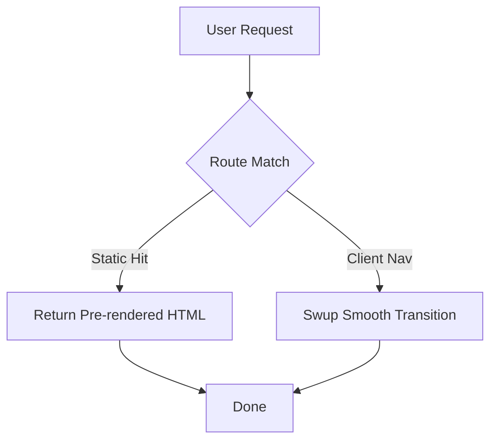
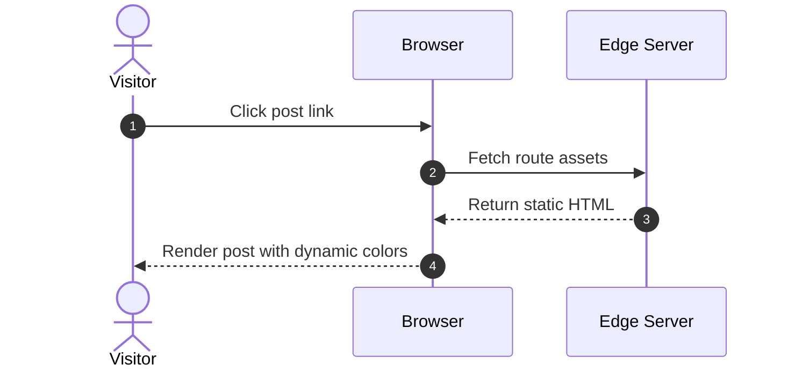
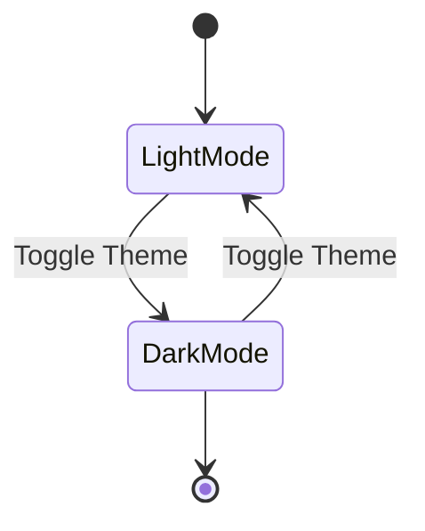

Shirone integrates the Mermaid diagramming library, allowing you to render flowcharts, sequence diagrams, state charts, and Gantt charts directly from Markdown.

## Flowcharts

````markdown

````

## Sequence Diagrams

````markdown

````

## State Diagrams

````markdown

````

## Highlights

- **Loaded On Demand**: Mermaid scripts load asynchronously only when diagrams are present in the current article.
- **Theme Synchronized**: Node strokes, fills, and text dynamically match the active Material 3 Expressive theme and dark mode.
