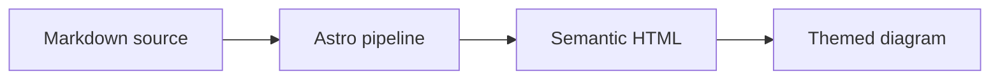
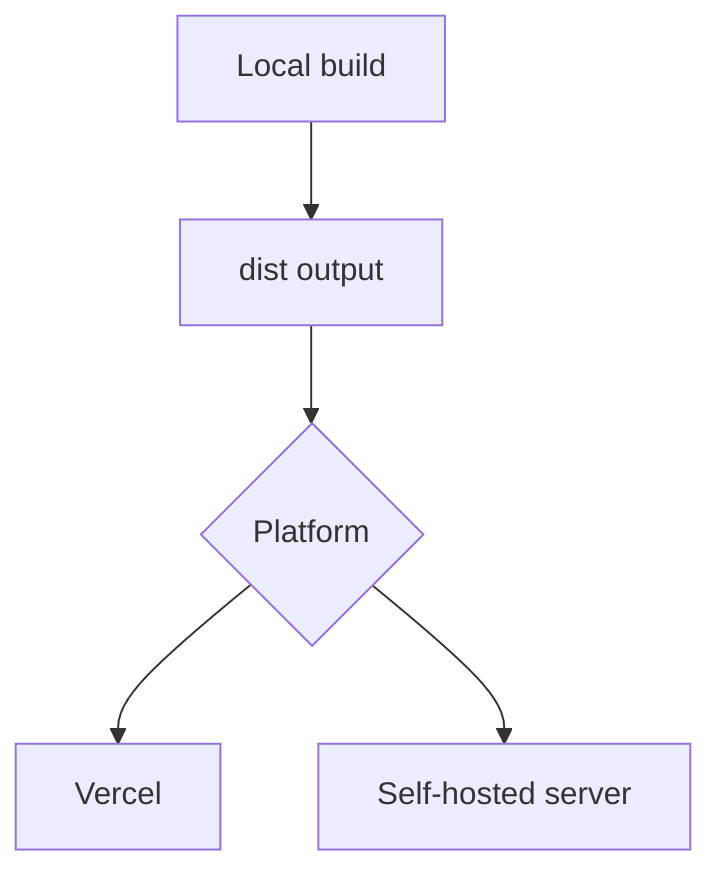

This page covers four media capabilities: Mermaid diagrams, video embeds, the audio reader, and GitHub repository cards. All of them generate fallback markup at build time and enhance on the client on demand—zero resources are loaded when the feature is absent.

## Mermaid Diagrams

Write diagrams in a `mermaid` fenced block. The build keeps readable source markup, and the browser enhances it into an SVG following the active theme; diagrams re-render on theme changes and Swup in-site navigation.

````markdown

````

All major diagram types are supported: flowcharts, sequence diagrams, ER diagrams, class diagrams, state diagrams, Gantt charts, pie charts, mind maps, timelines, user journeys, git graphs, kanban boards, Sankey diagrams (`sankey-beta`), and XY charts (`xychart-beta`).

::: tip Accessibility
Add `accTitle:` and `accDescr:` lines inside a diagram to provide an accessible name and description:

```text
flowchart TD
    accTitle: Article publishing workflow
    accDescr: An article moves through writing, validation, preview, and build before publication.
```

:::

## Video Embeds

Dedicated directives load players on demand, without hardcoded iframes:

```markdown
::youtube{id="5gIf0_xpFPI" title="YouTube video" preload="auto"}

::bilibili{bvid="BV1fK4y1s7Qf" title="Bilibili video" p=1 preload="auto"}

::acfun{acid="ac48649632" title="AcFun video" preload="auto"}

::artplayer{src="https://example.com/video.mp4" title="Direct video" preload="auto"}
```

| Directive | Parameters | Description |
| --- | --- | --- |
| `::youtube` | `id` | YouTube video ID |
| `::bilibili` | `bvid`, `p` | Bilibili BV ID and part number |
| `::acfun` | `acid` | AcFun video ID |
| `::artplayer` | `src` | Direct video URL (local or remote) |

Common parameters: `title` is the accessible name; `preload="auto"` allows preloading (the default is load-on-click).

You can also paste a platform-provided `<iframe>` embed directly, but you lose lazy loading and theme adaptation.

## Audio Reader

Render short audio clips as on-demand speaker buttons; resources load only after the button is pressed:

```markdown
:audio-reader[Clip title]{src="/assets/audio/filename.wav"}
```

- `src` must be a site-root path or an HTTPS URL
- The directive label cannot be empty; invalid directives remain ordinary Markdown and load nothing

## GitHub Repository Cards

Repository info is pulled from the GitHub API on page load and rendered as a card:

```markdown
::github{repo="LyraVoid/Shirone"}
```

The format is `::github{repo="<owner>/<repo>"}`. Note this component queries the GitHub API at runtime—cards degrade gracefully offline or when rate-limited.

## Embedding Example: A Rich Tutorial Post

````markdown
---
title: Deployment Architecture and Demo
---

## Architecture Overview



## Video Demo

::bilibili{bvid="BV1fK4y1s7Qf" title="Deployment demo" p=1}

## Related Projects

::github{repo="LyraVoid/Shirone"}
````

## FAQ

**Mermaid diagram not rendering**

Check that the fence language is `mermaid` and the diagram syntax is valid (syntax errors keep the source text visible). The `accTitle`/`accDescr` accessibility comments are supported.

**How to pick a Bilibili video part**

The `p` parameter specifies the part number, starting from 1.

**GitHub card keeps spinning**

The card depends on the GitHub API. Confirm the network is reachable and the repository exists (`owner/repo` spelled correctly); retry later if the anonymous API is rate-limited.

**Does audio autoplay**

No. Audio Reader stays quiet by design—clips load and play only after the reader presses the button.
