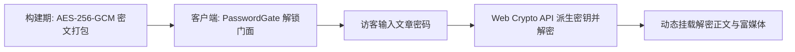

---
title: 业务实体与页面模块 (Organisms & Page Sections)
createTime: 2026/09/01 01:55:00
permalink: /guide/api/components/organisms/
---

业务实体与页面模块（Organisms）是 Shirone 各个独立功能页面的核心承载体，负责整合底层原子组件、处理用户交互状态并绑定数据源。

---

## AnimeSection

**文件**：`src/components/organisms/AnimeSection.svelte`  
**职责**：番剧页核心渲染模块，消费本地 `src/data/anime.ts` 或 Bangumi / Bilibili 离线快照，提供状态分类切换、评分条与进度展示。

### 数据接口规范

```ts
interface AnimeItem {
  title: string;
  status: "watching" | "completed" | "planned" | "onHold" | "dropped";
  rating: number;
  cover?: string;
  description?: string;
  progress?: {
    watched: number;
    total: number;
  };
  year?: string;
  studio?: string;
  genres?: string[];
  link?: string;
}

interface AnimeSectionProps {
  items: AnimeItem[];
  defaultStatus?: string;
}
```

---

## MomentSection

**文件**：`src/components/organisms/MomentSection.svelte`  
**职责**：瞬间（说说）瀑布流模块，支持多图网格、全屏图片预览（Lightbox）、相对时间转换（如“3小时前”）与文本排版。

### 数据接口规范

```ts
interface MomentItem {
  id: string;
  date: string | Date;
  content: string;
  images?: string[];
  tags?: string[];
  location?: string;
}

interface MomentSectionProps {
  moments: MomentItem[];
}
```

---

## FriendSection

**文件**：`src/components/organisms/FriendSection.svelte`  
**职责**：友链页面展示模块，提供分组标签过滤、头像加载失败优雅降级、随机乱序与访问链接外链保护（`rel="noopener noreferrer"`）。

### 数据接口规范

```ts
interface FriendItem {
  name: string;
  url: string;
  avatar: string;
  description: string;
  tags?: string[];
  color?: string;
}

interface FriendSectionProps {
  friends: FriendItem[];
  shuffle?: boolean;
}
```

---

## ProjectSection

**文件**：`src/components/organisms/ProjectSection.svelte`  
**职责**：开源项目与个人作品卡片网格，展示项目图标、技术栈徽标、GitHub Stars 统计与在线 Demo 入口。

### 数据接口规范

```ts
interface ProjectItem {
  name: string;
  description: string;
  link: string;
  preview?: string;
  icon?: string;
  techStack?: string[];
  stars?: number;
  featured?: boolean;
}

interface ProjectSectionProps {
  projects: ProjectItem[];
}
```

---

## SkillSection & DeviceSection

**文件**：`src/components/organisms/SkillSection.svelte` & `DeviceSection.svelte`  
**职责**：
- `SkillSection`：技术栈掌握熟练度图谱与能力分类卡片。
- `DeviceSection`：常用生产力设备、数码外设与评级清单。

---

## TimelineSection

**文件**：`src/components/organisms/TimelineSection.svelte`  
**职责**：个人建站大事记与履历时间轴，支持垂直时间线吸顶年份指示器与里程碑高亮。

---

## 内容加密与保护体系

**组件集**：`EncryptedContent.astro`, `PasswordGate.svelte`, `ProtectedPost.svelte`, `ProtectedAlbum.svelte`  
**职责**：构建文章与相册的客户端加密解密防线。

### 架构流程



- **零明文泄露**：加密文章在静态 HTML 中仅包含 Base64 密文与 IV，未输入正确密码前绝对不输出解密内容。
- **状态记忆**：解密成功后可在当前浏览器会话（Session）中安全保持解锁状态。
