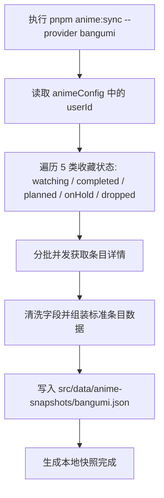

---
title: Bangumi API
createTime: 2026/09/01 01:05:00
permalink: /guide/api/user/bangumi/
---

Bangumi（番组计划，[bgm.tv](https://bgm.tv/)）是一个专注于动漫、游戏与 ACG 文化的社区。Shirone 的番剧页面通过官方 API v0 抓取用户的追番记录与条目元数据。

在架构上，Shirone 采用**双平面模型（Dual-Plane Model）**：API 交互仅发生在显式的离线同步阶段（`scripts/anime/providers/bangumi.mjs`），生成本地脱敏 JSON 快照；页面运行时与生产构建直接消费快照，**绝不对 Bangumi 发起任何运行时请求**。

## 配置方式

在 `src/config/animeConfig.ts` 中配置 Bangumi 数据源：

```ts title="src/config/animeConfig.ts"
export const animeConfig = withUserConfig("anime", {
  enable: true,
  source: {
    kind: "snapshot",
    provider: "bangumi",
  },
  fallback: {
    kind: "local", // 快照异常时回退到 src/data/anime.ts
  },
  providers: {
    bangumi: {
      enable: true,
      userId: "sai", // Bangumi 用户名或数字 UID
      request: {
        pageSize: 50,    // 单页数量（10 ~ 100，默认 50）
        maxItems: 300,   // 最大同步条目数
        minDelayMs: 200, // 分页请求间隔延迟（毫秒），防频控
      },
    },
  },
})
```

| 字段 | 类型 | 默认值 | 说明 |
| --- | --- | --- | --- |
| `enable` | `boolean` | `false` | 是否启用 Bangumi 同步提供方 |
| `userId` | `string` | `""` | 你的 Bangumi 用户名（Username）或数字 UID |
| `request.pageSize` | `number` | `50` | 单次分页请求条数（限制 10~100） |
| `request.maxItems` | `number` | `100` | 最多拉取的条目上限 |
| `request.minDelayMs` | `number` | `200` | 分页请求之间的间隔延迟（毫秒），避免触发平台限流 |

## 调用的 API 端点

Bangumi 官方接口基地址为 `https://api.bgm.tv`，所有请求必须携带合规的 `User-Agent` 请求头。

### 1. 获取用户收藏列表

用于按状态批量拉取用户的动漫收藏条目。

- **端点**：`GET /v0/users/{userId}/collections`
- **请求参数**：

| 参数 | 类型 | 说明 |
| --- | --- | --- |
| `subject_type` | `number` | 固定为 `2`（动画条目） |
| `type` | `number` | 收藏状态类型：`1` 想看 / `2` 看过 / `3` 在看 / `4` 搁置 / `5` 抛弃 |
| `limit` | `number` | 每页数量（默认 50） |
| `offset` | `number` | 分页偏移量 |

- **示例响应**：
```json
{
  "total": 42,
  "limit": 50,
  "offset": 0,
  "data": [
    {
      "subject_id": 308479,
      "subject_type": 2,
      "rate": 9,
      "type": 3,
      "ep_status": 12,
      "subject": {
        "id": 308479,
        "name": "Lycoris Recoil",
        "name_cn": "莉可丽丝",
        "short_summary": "平稳的日子──其实暗藏玄机...",
        "date": "2022-07-02",
        "images": {
          "large": "https://lain.bgm.tv/pic/cover/l/...",
          "medium": "https://lain.bgm.tv/pic/cover/m/..."
        },
        "eps": 13,
        "score": 8.1
      }
    }
  ]
}
```

### 2. 获取条目详情

Shirone 以 **6 并发分批** 调用条目详情接口，深度提取制作方、完整标签和详细简介。

- **端点**：`GET /v0/subjects/{subjectId}`
- **提取与转换逻辑**：
  - **标题优先**：`name_cn`（中文译名）优先，无中文名时回退为 `name`（原名）。
  - **制作公司提取**：智能检索 `infobox` 中 `动画制作`、`制作`、`製作`、`开发`、`Animation Production` 键值。
  - **题材标签**：提取 `tags` 数组为分类标签。
  - **评分与进度**：提取用户个人评分 `rate`（缺失时取社区均分 `score`）与观看集数 `ep_status`。

## 同步执行流程



执行命令生成快照：

```bash
pnpm anime:sync --provider bangumi
```

## 产物与双仓模式

- **快照产物**：保存在 `src/data/anime-snapshots/bangumi.json` 中。
- **内容分离友好**：在内容分离架构中，快照可直接提交到内容仓，主题构建时读取静态文件直出 HTML，无需在 CI 构建机配置外部凭据或依赖外部网络。

## 常见问题

**同步时提示 404 Not Found**

检查 `userId` 是否正确。支持 Bangumi 的个性域名用户名（如 `sai`）或纯数字 UID。若用户主页设置为完全私密，未公开的收藏无法通过公开 API 抓取。

**频繁同步被 Bangumi 限流（429 Too Many Requests）**

适当增加 `request.minDelayMs`（例如调整为 `500`），降低单次抓取的并发节奏。

**部分条目制作公司显示为空**

部分冷门条目的 Bangumi Infobox 维基数据中未录入制作公司字段，Shirone 会优雅略过该属性，不影响其他信息的展示。
