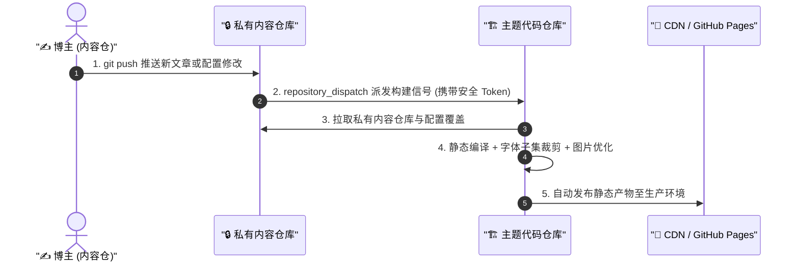

# 跨仓自动化构建与发布

这是官方推荐的自动化部署方案。

在这种模式下，内容仓库每次推送更新，会自动通知主题代码仓库。代码仓库的 GitHub Actions 会执行配置验证、中文字体切片、全量静态构建，并自动发布上线。



---

## 核心配置步骤

::: steps
1. **生成 GitHub 个人访问令牌（PAT）**

   为了让私有内容仓库能够向主题代码仓库发送派发信号，需要创建一个具备仓库触发权限的访问令牌：

   - 登录 GitHub，点击右上角头像 -> **Settings** -> **Developer Settings**；
   - 选择 **Personal access tokens** -> **Fine-grained tokens**（或 Classic Tokens）；
   - 点击 **Generate new token**；
   - **Repository access**：选择 **Only select repositories**，并勾选你的 ==主题代码仓库==；
   - **Permissions**：在 **Repository permissions** 下找到 **Contents**，设为 ==Read and write=={.error}；
   - 点击底部 **Generate token** 生成令牌并**立即复制保存**。

   

   > [!CAUTION] 访问令牌安全保管
   > 令牌生成后仅展示一次。==绝不能将此令牌明文写进任何公共文件或代码中=={.error}，必须保存到 GitHub 仓库的 Encrypted Secrets 中。

2. **在私有内容仓库中配置 Secret**

   - 进入你的 ==私有内容仓库==；
   - 点击 **Settings** -> **Secrets and variables** -> **Actions**；
   - 点击 **New repository secret**；
   - **Name**：填写 ==DISPATCH_TOKEN=={.tip}（必须完全一致，区分大小写）；
   - **Secret**：粘贴上一步生成的 Personal Access Token；
   - 点击 **Add secret** 保存。

   

3. **在内容仓库中添加触发工作流**

   在私有内容仓库的 `.github/workflows/` 目录下新建 `trigger-build.yml` 文件：

   ```yaml title=".github/workflows/trigger-build.yml"
   name: Trigger Theme Build

   on:
     push:
       branches: [main]
     workflow_dispatch:

   jobs:
     dispatch:
       runs-on: ubuntu-latest
       steps:
         - name: Dispatch build event to theme repository
           uses: peter-evans/repository-dispatch@v3
           with:
             token: ${{ secrets.DISPATCH_TOKEN }} # [!code highlight]
             repository: YOUR_GITHUB_USERNAME/YOUR_THEME_REPO_NAME # 请替换为你的主题代码仓路径 # [!code warning]
             event-type: content-update
   ```

4. **在主题代码仓库中配置响应工作流**

   在主题代码仓库的 `.github/workflows/` 目录下新建或更新 `deploy.yml`，监听派发事件：

   ```yaml title=".github/workflows/deploy.yml"
   name: Deploy Shirone Blog

   on:
     push:
       branches: [main]
     repository_dispatch:
       types: [content-update] # 响应内容仓库发送的派发事件 # [!code highlight]
     workflow_dispatch:

   jobs:
     build-and-deploy:
       runs-on: ubuntu-latest
       steps:
         - name: Checkout Theme Repo
           uses: actions/checkout@v4

         - name: Setup Node.js & pnpm
           uses: pnpm/action-setup@v3
           with:
             version: 9

         - name: Setup Node
           uses: actions/setup-node@v4
           with:
             node-version: 20
             cache: "pnpm"

         - name: Install Dependencies
           run: pnpm install --frozen-lockfile

         - name: Pull Private Content & Build
           env:
             CONTENT_REPO_URL: "https://x-access-token:${{ secrets.CONTENT_ACCESS_TOKEN }}@github.com/${{ github.repository_owner }}/my-blog-content.git" # [!code highlight]
           run: |
             pnpm content:sync
             pnpm build

         - name: Deploy to GitHub Pages
           uses: peaceiris/actions-gh-pages@v4
           with:
             github_token: ${{ secrets.GITHUB_TOKEN }}
             publish_dir: ./dist
   ```
:::

---

## 验证自动化流水线

完成配置后，进行一次端到端验证：

::: steps
1. 在外部内容仓库中新建或修改一篇 Markdown 文章；
2. 执行 `git add .`、`git commit -m "docs: test dispatch"` 并 `git push` 推送到 GitHub；
3. 打开内容仓库的 **Actions** 面板，观察 `Trigger Theme Build` 是否成功派发；
4. 打开主题代码仓库的 **Actions** 面板，观察 `Deploy Shirone Blog` 是否被自动触发并成功发布。
:::

---

## 下一步

- 前往 [云托管平台 Deploy Hook 部署](/guide/content-separation/deploy-hooks/)：了解 Cloudflare Pages、Vercel 与 EdgeOne 的集成方案
