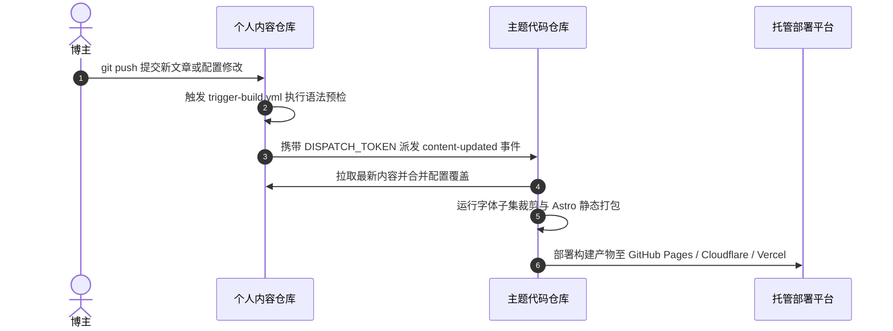

# 跨仓自动化构建与发布

这是官方推荐的自动化部署方案。

在这种模式下，内容仓库每次推送更新，会自动通知主题代码仓库。代码仓库的 GitHub Actions 会执行配置验证、中文字体切片、全量静态构建，并自动发布上线。



---

## 第一步：创建 GitHub 个人访问令牌

我们需要生成一个专用令牌，用来让内容仓库有权限通知代码仓库启动构建。

1. **前往个人设置**：点击 GitHub 页面右上角头像，进入 Settings 设置页面；

   

2. **进入开发者设置**：在左侧导航栏滑到底部，点击 Developer Settings；

   

   

3. **进入细粒度令牌**：依次点击左侧的 Personal access tokens 下的 Fine-grained tokens；

   

4. **新建令牌**：点击右上角的 Generate new token 按钮；

   

5. **配置令牌属性与权限**：
   - **Token name**：填入 `DISPATCH_TOKEN`（或自定义名称）；
   - **Expiration**：选择过期时间（建议选择 90 天或按需设置）；
   - **Repository access**：**务必选择 Only select repositories**，并在下拉菜单中**只勾选你的主题代码仓库**；

     

   - **Permissions -> Repository permissions**：展开仓库权限列表，找到 **Contents**，将其权限修改为 **Read and write**（用于触发工作流派发）；

     

6. **生成并妥善复制令牌**：滑动至页面最底部，点击绿色按钮 Generate token，**立即复制生成的令牌字符串并妥善保存**。

   

---

## 第二步：在内容仓库配置派发密钥与工作流

1. **启用触发工作流**：在内容仓库中，将 `.github/workflows/trigger-build.yml.example` 重命名为 `.github/workflows/trigger-build.yml`（通过 `pnpm content:eject` 初始化的仓库已默认启用）；
2. **进入密钥设置**：
   - 打开你的**个人内容仓库**（例如 `my-blog-content`）；
   - 点击顶部导航栏的 **Settings**；
   - 在左侧菜单中展开 **Secrets and variables**，选择 **Actions**；
   - 点击页面右侧的 **New repository secret**；
   - **Name**：必须填入 `DISPATCH_TOKEN`（全大写）；
   - **Secret**：粘贴第一步中复制的个人访问令牌；
   - 点击 **Add secret** 保存。

---

## 第三步：在主题代码仓启用部署工作流

1. 打开你的**主题代码仓库**；
2. 进入目录 `.github/workflows/`；
3. 将示例工作流 `deploy.yml.example` 重命名为 `deploy.yml`；
4. 修改文件开头的环境变量配置：
   ```yaml
   env:
     # 替换为你的内容仓库路径
     CONTENT_REPOSITORY: yourname/my-blog-content
     CONTENT_WORKING_COPY: .content-src
   ```
5. **如果内容仓是私有仓库**：
   - 生成一个具备内容仓读取权限的个人访问令牌；
   - 在主题代码仓的 **Settings** -> **Secrets and variables** -> **Actions** 中添加 Secret，名称为 `CONTENT_REPO_TOKEN`，值为该令牌；
6. 提交并推送到代码仓的主分支。

---

## 第四步：验证全自动构建与发布

现在，只需在内容仓库中修改任意一篇文章并执行推送：

```bash
git add .
git commit -m "feat: 发布一篇新文章"
git push origin main
```

1. 打开内容仓库的 **Actions** 页面，你将看到 `Trigger Theme Build` 工作流被自动触发并成功派发事件；
2. 随后打开代码仓库的 **Actions** 页面，主题代码仓正在全自动拉取内容并完成编译部署；
3. 构建完成后，刷新你的博客网站，新文章即可完成全网发布。

---

## 并发构建与版本回滚保障

### 1. 并发抢占与自动截断
代码仓部署流水线配置了全局并发控制（`concurrency: group: deploy, cancel-in-progress: true`）。当博主短时间内高频提交时，后续新触发的构建会自动强制取消正在执行中的旧构建，无缝切换到最新一次构建，杜绝并发竞争或旧文章覆盖新内容。

### 2. 零代码历史版本紧急回滚
如果线上刚发布的文章存在严重错误：
- 直接在代码仓进入 **Actions** 页面；
- 选择 **Deploy** 工作流并点击 **Run workflow**；
- 在弹出的 `content_ref` 输入框中填入历史版本的 Git Commit SHA，即可一键拉取指定历史版本并完成部署上线。

---

## 下一步

- 前往 [云托管平台 Deploy Hook 部署](/guide/content-separation/deploy-hooks/)：了解 Cloudflare Pages、Vercel、EdgeOne 等平台的部署钩子配置方式
