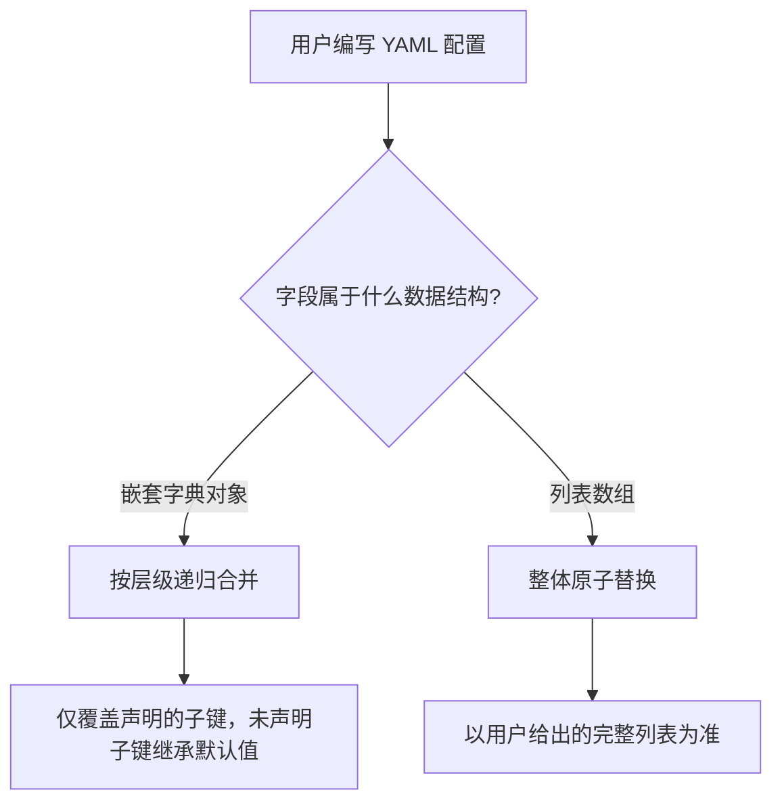

在 Shirone 体系中，全站配置采用 ==声明式覆盖机制==。你无需修改主题的核心代码，只需在内容仓库的 `config/` 目录下按需编写对应的 YAML 配置文件，即可轻松定制站点的每一个细节。

---

## 核心设计理念

### 1. 最小化覆盖原则 <Badge text="精简" type="tip" />
在 YAML 文件中，你 ==只需要声明自己想要定制的字段=={.tip}，未填写的字段会自动继承主题的默认配置。

这样做有两大核心优势：
- **配置文件极其清爽**：无需维护包含数千行默认值的庞大配置文件；
- **主题升级平滑**：当主题发布新版本并引入新的配置项或优化默认值时，博客会自动继承新特性，避免旧默认值覆盖导致布局异常。

### 2. 区分对象合并与数组替换

在编写 YAML 配置时，系统遵循两大合并规则：



#### 嵌套对象（按层级递归合并）
例如在 `site.yaml` 中，如果你只想修改横幅壁纸打字机的输入速度，只需写：

```yaml title="config/site.yaml"
banner:
  homeText:
    typewriter:
      speed: 150
```

打字机的删除速度、停顿时间以及壁纸轮播的其他参数仍会自动继承主题默认值。

#### 列表数组（整体替换）
凡是数组类型的清单（例如顶栏导航条目 `nav-bar.yaml`、侧边栏组件清单 `sidebar.yaml`、社交外链 `profile.links`、网站图标 `site.favicon`），均采用 ==整体替换=={.error} 规则。

> [!WARNING] 数组整体替换规则
> 列表项的增删与排列顺序具有强烈的整体性，局部追加容易引起顺序歧义。
> 因此在配置数组字段时，==必须完整列出你希望保留和展示的所有条目=={.error}。

---

## 配置生效机制与类型安全检查

### 1. 拼写错误智能纠错提示

在修改 YAML 时，偶尔可能会手滑打错配置项名称或填错格式。

Shirone 内置了严格的类型检查机制。在运行 `pnpm content:validate` 预检或执行内容同步时，系统会在内存中快速完成检查。一旦发现拼写错误，终端会明确指出发生错误的文件与属性路径，并贴心地推测你原本想写的正确字段：

```text title="Terminal Typo Suggestion"
  config/site.yaml's banner.homeText: Type '{ titel: string }' is not assignable to type 'DeepPartial<HomeTextConfig>'
    Did you mean "title"?
```

这种机制让你在本地就能第一时间发现并修正问题，无需等到部署上线后才排查错误。

### 2. 桥接文件自动化处理

在执行同步（`pnpm content:sync`）或进行生产构建时，系统会在后台自动将 `config/` 目录下的所有 YAML 文件整合转换为 `src/user/user-config.ts` 桥接文件。

这个过程会在后台自动完成核心优化：

::: steps
1. **图标自动打包离线化**

   自动扫描你在配置中填写的每一个图标名称，并在构建期打包进本地资源，访问时无需向外部网络请求图标。

2. **站点文字自动参与字体瘦身**

   自动提取你在配置中填写的网站主副标题、博主昵称与签名等文本，送入中文字体裁剪流水线，确保中文字体不缺字且体积小巧。

3. **完全自动化维护**

   该桥接文件属于系统生成物，每次同步都会自动刷新，日常完全不需要手动去查看或修改它。
:::

---

## 全站配置文件速查总表

所有配置文件均存放在内容仓库的 `config/` 目录下，按功能领域划分：

### 1. 全局基础与外观

| 配置文件路径 | 负责的功能领域 | 默认覆盖策略 |
| :--- | :--- | :--- |
| `config/site.yaml` | 站点基本标识、时区、横幅壁纸、多图轮播、打字机、背景纹理 | 对象递归合并 |
| `config/profile.yaml` | 博主头像、昵称、签名、社交平台链接列表 | 对象合并（`links` 数组替换） |
| `config/nav-bar.yaml` | 顶部导航栏条目清单、预设条目与下拉子菜单 | ==数组整体替换== |
| `config/sidebar.yaml` | 侧边栏单双栏模式、侧栏组件排布与吸顶规则 | 对象合并（`components` 数组替换） |
| `config/font.yaml` | 全站中文字体、西文字体、等宽代码字体与子集化裁剪 | 对象合并（`fontFamilies` 数组替换） |
| `config/context-menu.yaml` | 桌面端右键上下文菜单、快捷动作清单与页面过滤 | 对象合并（`actions` 数组替换） |
| `config/footer.yaml` | 页脚文案与备案信息 | 对象递归合并 |
| `config/footer.html` | 自定义注入的页脚 HTML 片段 | 完整替换 |

### 2. 内容与文章排版

| 配置文件路径 | 负责的功能领域 | 默认覆盖策略 |
| :--- | :--- | :--- |
| `config/post-list.yaml` | 文章列表分页大小、列表或网格排版模式 | 对象递归合并 |
| `config/article.yaml` | 文章阅读时长、长期未更新提醒、相关文章推荐与海报分享 | 对象递归合并 |
| `config/announcement.yaml` | 全局浮动公告栏配置 | 对象递归合并 |
| `config/expressive-code.yaml` | 代码高亮主题与代码块行号显示 | 对象递归合并 |

### 3. 特色功能与独立页面

| 配置文件路径 | 负责的功能领域 | 默认覆盖策略 |
| :--- | :--- | :--- |
| `config/anime.yaml` | 追番追剧页面主数据源、Bilibili 与 Bangumi 同步策略 | 对象递归合并 |
| `config/music.yaml` | 侧栏音乐播放器模式、网易云歌单与自定义曲目 | 对象递归合并 |
| `config/comment.yaml` | 评论系统服务提供商与 Twikoo 连接参数 | 对象递归合并 |
| `config/devices.yaml` | 个人数码设备展示页分类与筛选规则 | 对象合并（`categories` 数组替换） |
| `config/projects.yaml` | 开源项目展示页分类与阶段筛选规则 | 对象合并（`categories` 数组替换） |
| `config/skills.yaml` | 技能图谱页分类与熟练度规则 | 对象合并（`categories` 数组替换） |
| `config/timeline.yaml` | 大事记时间线分类与展示规则 | 对象合并（`categories` 数组替换） |
| `config/friends.yaml` | 友情链接分组规则与丢失检测策略 | 对象合并（`groups` 数组替换） |
| `config/umami.yaml` | Umami 访问统计分析 | 对象递归合并 |
| `config/llms.yaml` | 大模型 AI 检索增强 | 对象递归合并 |

---

## 常用配置覆盖示例

### 示例 1：修改站点标题与横幅壁纸

```yaml title="config/site.yaml"
# 仅需声明要修改的字段，其他全部继承主题默认值
title: "我的技术博客"
description: "分享编程与生活"
favicon: "/favicon.ico"

banner:
  enable: true
  homeText:
    title: "你好，世界"
    subtitle: "探索数字世界之美"
    typewriter:
      enable: true
      speed: 120
```

### 示例 2：自定义侧边栏组件排布

```yaml title="config/sidebar.yaml"
layout: "two-column"
sticky: "toc"

# 数组整体替换：仅启用并按顺序展示以下 4 个组件
components:
  - "profile"
  - "toc"
  - "recent-posts"
  - "tags"
```

---

## 下一步

- 前往 [跨仓自动化构建与发布](/guide/content-separation/ci-dispatch/)：配置 GitHub Actions 实现双仓联动自动构建
