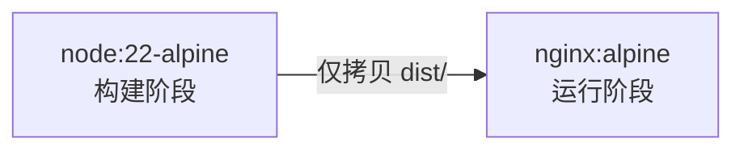

用 Docker 部署 Shirone 可以做到「一次构建，随处运行」：环境完全隔离、版本可回滚、迁移服务器只需迁移镜像。

## 架构说明

Shirone 是纯静态站点，容器化采用经典的**多阶段构建**：



- **构建阶段**：Node 22 + pnpm 环境执行完整 `pnpm build`（含 Pagefind 索引）
- **运行阶段**：只保留 Nginx 与静态产物，最终镜像不到 50 MB，无 Node 运行时

## 准备文件

在项目根目录创建三个文件。

### .dockerignore

排除无关文件，减小构建上下文、加速构建：

```text title=".dockerignore"
.git
node_modules
dist
.astro
.vscode
.github
docs
tests
scripts
public/assets/moments/thumbnails
```

### Dockerfile

```dockerfile title="Dockerfile"
# ---------- 构建阶段 ----------
FROM node:22-alpine AS builder

WORKDIR /app

# 启用 corepack 以使用仓库锁定的 pnpm 版本
RUN corepack enable

# 先复制依赖清单，充分利用镜像层缓存
COPY package.json pnpm-lock.yaml .npmrc ./
RUN pnpm install --frozen-lockfile

# 再复制源码并构建
COPY . .
RUN pnpm build

# ---------- 运行阶段 ----------
FROM nginx:alpine

COPY --from=builder /app/dist /usr/share/nginx/html
COPY nginx.conf /etc/nginx/conf.d/default.conf

EXPOSE 80

CMD ["nginx", "-g", "daemon off;"]
```

::: tip 层缓存技巧
依赖清单与源码分两次 `COPY`，使得只有依赖变更时才会重新执行 `pnpm install`。日常改文章重新构建时，安装步骤直接命中缓存，构建时间大幅缩短。
:::

### nginx.conf

```nginx title="nginx.conf"
server {
    listen 80;
    server_name _;
    root /usr/share/nginx/html;
    index index.html;

    gzip on;
    gzip_types text/css application/javascript application/json image/svg+xml;
    gzip_min_length 1024;

    location /assets/ {
        expires 1y;
        add_header Cache-Control "public, immutable";
    }

    location /pagefind/ {
        expires 24h;
    }

    location / {
        try_files $uri $uri/ =404;
    }
}
```

> [!WARNING]
> **构建阶段内存分配预警**
> Shirone 构建包含字体子集化与 Pagefind 索引生成，内存峰值较高。请为 Docker 分配至少 4 GB 内存，或在命令中添加 `--memory=4g`。

## 构建与运行

::: steps

1. **构建生产 Docker 镜像**

   利用多阶段缓存机制在本地或 CI 构建镜像：
   ```bash
   docker build -t shirone-blog .
   ```

2. **启动并后台运行容器**

   将容器 80 端口映射至宿主机指定端口（如 8080）并启用自动重启策略：
   ```bash
   docker run -d --name shirone-blog -p 8080:80 --restart unless-stopped shirone-blog
   ```

   - `-d`：后台守护进程运行
   - `-p 8080:80`：主机 8080 端口映射到容器 80 端口
   - `--restart unless-stopped`：容器崩溃或宿主机重启后自动拉起

3. **验证容器服务**

   在浏览器中访问 `http://localhost:8080`，验证全站页面路由与 Pagefind 离线搜索。

:::

## 使用 Docker Compose

推荐用 Compose 管理，配置即文件、可纳入版本控制：

```yaml title="docker-compose.yml"
services:
  shirone:
    build: .
    container_name: shirone-blog
    ports:
      - "8080:80"
    restart: unless-stopped
```

```bash
docker compose up -d      # 构建并启动
docker compose up -d --build   # 内容更新后重新构建部署
```

## 更新部署

文章更新后的标准流程：

```bash
git pull                    # 拉取最新内容
docker compose up -d --build   # 重建镜像并滚动替换容器
```

旧镜像会保留在本地，出问题时可一键回滚：

```bash
docker tag <old-image-id> shirone-blog:rollback
docker compose up -d shirone-blog  # 需要回滚时切回旧 tag
```

## 对外暴露：反代与 HTTPS

生产环境通常不在容器上直接暴露 80/443，而是由宿主机的 Nginx / Caddy 反代：

```nginx title="宿主机 /etc/nginx/conf.d/blog.conf"
server {
    listen 443 ssl;
    server_name your-domain.com;

    # SSL 证书配置省略（可用 certbot 自动管理）

    location / {
        proxy_pass http://127.0.0.1:8080;
        proxy_set_header Host $host;
        proxy_set_header X-Real-IP $remote_addr;
    }
}
```

## 常见问题

::: collapse
- 构建失败：`only-allow pnpm` 或依赖安装报错

  使用了 `npm install` 而非 pnpm，或未启用 corepack。严格按 Dockerfile 写法：`corepack enable` + `pnpm install --frozen-lockfile`。

- 构建阶段 OOM

  Shirone 构建含字体子集化与 Pagefind 索引，内存峰值较高。为 Docker 分配至少 4 GB 内存，或使用构建参数 `--memory=4g`（docker build）。

  **搜索不可用（404 on /pagefind/*）**

  Pagefind 索引由 `pnpm build` 末尾生成，确认构建阶段命令没有被精简为单独的 `astro build`——那样会跳过索引步骤。

- 镜像里能放评论服务等动态功能吗

  不建议。静态容器保持无状态更易维护；评论（Twikoo/Waline 等）作为独立容器部署，Nginx 反代区分路径。
:::
