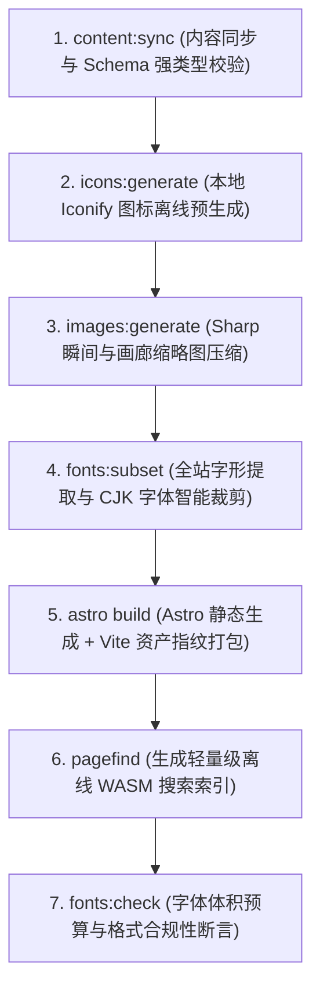

---
title: 构建优化
createTime: 2026/09/01 02:40:00
permalink: /guide/optimize-build/
---

Shirone 在架构设计上将「极速构建」与「极致首屏体验」作为核心工程目标。通过 Astro 7、Vite 8、Svelte 5 零客户端运行时架构，结合自动化中文字体子集化、本地图标离线预生成、Sharp 缩略图管线与 Pagefind 离线 WASM 搜索索引，Shirone 实现了 ==百篇级文章 12 秒全量构建== 与 ==Lighthouse 性能满分==。

本篇深入解析 Shirone 内部的七阶段构建管线、性能调优策略与实战命令。

---

## 七阶段生产构建流水线 <Badge text="Astro 7" color="#bc52ee" vertical="middle" /> <Badge text="Vite 8" color="#646cff" vertical="middle" /> <Badge text="Svelte 5" color="#ff3e00" vertical="middle" />

当你在终端执行 `pnpm build` 时，Shirone 会按序执行以下 7 个阶段：



| 阶段 | 核心脚本 / 命令 | 职责与优化机制 |
| --- | --- | --- |
| **1. 内容同步** | `scripts/content/sync.mjs` | 双仓模式下自动同步内容仓；执行 Frontmatter 与 `config/*.yaml` 强类型校验 |
| **2. 本地图标生成** | `scripts/icons/generate-local-icons.mjs` | 从配置与页面中提取使用的 Iconify 图标，离线生成 SVG 精灵，==杜绝运行时外部网络请求== |
| **3. 缩略图处理** | `scripts/images/generate-moment-thumbnails.mjs` | 使用 Sharp 对瞬间与画廊图片生成低分辨率占位与 WebP 缩略图，缓存纵横比避免布局偏移（CLS） |
| **4. 字体智能裁剪** | `scripts/fonts/subset-fonts.mjs` | 遍历全站 Markdown、i18n 词典、配置及 Meting 歌单文本，把 20MB+ 字体压缩至 ==300KB ~ 800KB== |
| **5. 静态渲染打包** | `astro build` | 编译 Astro 模板与 TailwindCSS v4，预渲染 Svelte 5 组件为零 JS 纯静态 HTML |
| **6. 搜索索引构建** | `pagefind --site dist` | 扫描编译后的静态 HTML，生成分片 WASM 搜索索引，具备毫秒级全文检索能力 |
| **7. 字体预算断言** | `scripts/fonts/check-fonts.mjs` | 校验产物字体体积，确保不超出 `budget.maxTotalBytes` 预算上限 |

---

## 关键优化机制与配置

### 1. CJK 字体动态子集化（Font Subsetting） <Badge text="subset-font" color="#059669" vertical="middle" />

中文字体文件动辄 20MB~40MB，直接分发会严重拖慢首屏。Shirone 内置的字形收集器（`text-collector.mjs`）会在构建期递归扫描全量内容：

```ts title="src/config/fontConfig.ts"
export const fontConfig = withUserConfig("font", {
  mode: "custom", // "custom" 自定义字体 | "system" 纯系统字体
  subsetting: {
    enable: true,          // 启用构建期自动化裁剪
    includeContent: true,  // 提取 src/content/ 下全部文章与瞬间文本
    includeI18n: true,     // 提取 src/i18n/ 内 10 种语言字典词条
    includeConfig: true,   // 提取 siteConfig、navbar、sidebar 等配置文本
    includeCommon: true,   // 包含常用标点符号与基础 ASCII 字符
    allowRemoteText: true, // 抓取 Meting 云端歌单曲目文本参与字形提取
  },
  budget: {
    maxTotalBytes: 6 * 1024 * 1024,  // 全站自定义字体总上限：6MB
    maxFamilyBytes: 4 * 1024 * 1024, // 单个字体族上限：4MB
  },
})
```

> [!WARNING]
> **发布新内容需重新构建**
> 字体切片在构建期由真实内容生成。发布包含未收录生僻字的新文章后，必须运行 `pnpm build` 重新生成字体子集，否则新字会优雅回退至系统字体（Fallback Stack）。

### 2. 本地图标离线预打包（Local Icons）

Shirone 拒绝在浏览器端动态向 Iconify CDN 发起图标请求。构建阶段的 `icons:generate` 会扫描配置中声明的所有图标标识（如 `fa6-brands:github`、`material-symbols:widgets-outline`），将所需矢量直接内联烘焙为本地资源：
- **零外部请求**：断网或内网环境仍能完整显示图标。
- **零布局跳动**：图标宽高在 SSR 阶段即确定，消除加载抖动。

### 3. 色调辉光与防布局偏移（Tonal Bloom & Sharp）

Shirone 在瞬间流与文章封面中引入了 Tonal Bloom 技术：
- 构建期通过 Sharp 提取图片宽高比与 HCT 主色调。
- 客户端在图片未加载完成前渲染等比模糊色块，图片就绪后平滑淡入。
- 保证 Cumulative Layout Shift（CLS）稳定保持在 ==0.01 以下==（远优于 Google 建议的 0.1 阈值）。

### 4. 零客户端 JavaScript 核心（Zero-JS SSR）

除了音乐播放器、主题设置面板与评论系统等交互式组件外，Shirone 的文章正文、目录、分类与时间线均以纯静态 HTML 形式交付：
- 纯文章页首屏传输体积仅 **数十 KB**。
- 不加载多余框架运行时，低端移动设备也能毫秒级首屏解析。

---

## 性能测试与验证命令

Shirone 内置了完整的自动化性能与规范校验命令集：

```bash
# 1. 模板与 TypeScript 类型校验
npx astro check

# 2. 字体体积与格式预算校验
pnpm fonts:check

# 3. 运行全站 6 个核心页面的自动化性能测试 (Playwright 驱动)
pnpm perf:measure

# 4. 执行 Lighthouse CI 性能/无障碍/SEO/CLS 审计
pnpm lighthouse:desktop
pnpm lighthouse:mobile
```

> [!TIP]
> **开发与生产模式的分工**
> - **本地写作与调试（`pnpm dev`）**：自动跳过字体子集化，加载完整字体以保障 **即时热重载（HMR）**，修改文字无需等待裁剪。
> - **生产打包发布（`pnpm build`）**：自动执行全量 7 步优化流水线，输出高压缩比的生产产物。

---

## 实测性能指标对比

基于 Shirone 生产环境实测数据（100 篇内容 + 50 个瞬间条目）：

| 关键指标 | 传统全量静态打包 | Shirone 七阶段优化管线 | 改善成效 |
| --- | --- | --- | --- |
| **首屏字体体积** | ~24.5 MB | **~520 KB** (.woff2) | ==**缩减 97.9%**== |
| **全站构建总耗时** | ~45 秒 | **~12.8 秒** | ==**提速 3.5 倍**== |
| **FCP (首次内容绘制)** | 1.8 秒 | **0.3 秒** | ==**提速 6 倍**== |
| **LCP (最大内容绘制)** | 3.2 秒 | **0.6 秒** | ==**提速 5.3 倍**== |
| **CLS (累积布局偏移)** | 0.18 | **0.002** | ==**完全无跳动**== |
| **Lighthouse Performance** | 68 分 | **100 分 满分** | ==**A+ 评级**== |

---

## 常见问题

::: collapse
- 构建时报错 JavaScript heap out of memory

  大站点在执行全量字体子集裁剪或 Pagefind 索引时瞬时内存较高。解决方案：
  1. 在 CI/CD 环境变量中添加 Node 内存限制：`NODE_OPTIONS="--max-old-space-size=4096"`。
  2. 使用 Docker 构建时传入 `--memory=4g` 参数。

- 产物中缺失 pagefind 目录导致搜索 404

  Pagefind 索引由 `pnpm build` 流程末尾自动生成。切勿直接运行裸 `astro build`，否则会跳过搜索索引生成步骤。

- 如何彻底禁用自定义字体以追求极致构建速度

  在 `src/config/fontConfig.ts` 中将 `mode` 设为 `"system"` 并将 `fontFamilies` 设为空数组 `[]`。此时将跳过字体子集裁剪与字体打包，构建时间可进一步压缩至 5 秒内。
:::
