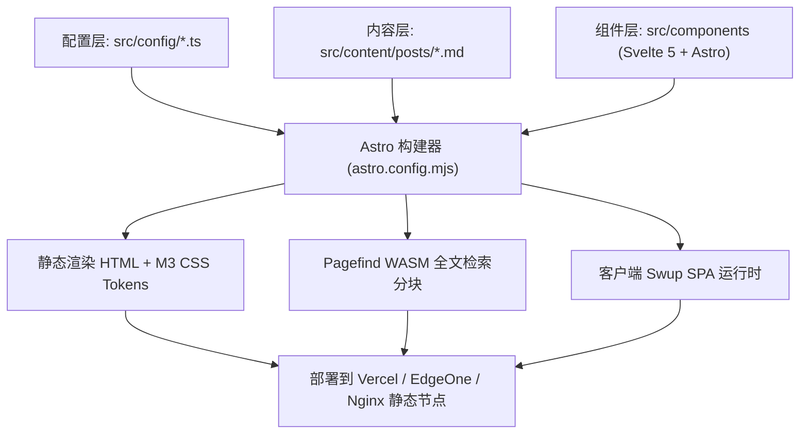

Shirone 是一个基于 ==**Astro 5 + Svelte 5 + Tailwind CSS + TypeScript**== 构建的高性能现代化静态博客系统。项目遵循 ==**关注点分离（SoC）**== 与 ==**原子化设计规范（Atomic Design）**==，具备清晰的模块边界与强类型配置约束。

本篇将通过文件树与代码树等多种展示形态，深入剖析 Shirone 的工程骨架与模块协作机制。

---

## 根目录架构总览

项目根目录包含了静态资源、构建配置、自动化脚本以及核心源码：

::: file-tree title="Shirone 工程根目录"
- public/ # 纯静态资源（favicon、自定义字体、robots.txt 等无需编译的文件）
  - favicon.svg # 站点主图标
  - fonts/ # 本地中英文字体分包
- src/ # 核心源码目录
  - assets/ # 由 Vite / Astro 处理的静态资源（默认横幅、插画）
  - components/ # Svelte 5 原子组件与 Astro 业务模块
  - config/ # 强类型站点配置文件群
  - content/ # Markdown 文章与独立数据集合
  - layouts/ # 顶层页面布局（MainLayout、PostLayout）
  - pages/ # 静态路由与动态页面生成
  - styles/ # M3 Expressive Tokens 与全局 CSS 样式
  - utils/ # 算法工具库（WebCrypto、动态配色、音频单例）
- scripts/ # 自动化构建与离线同步脚本
  - sync-bangumi.ts # Bangumi 追番数据同步
  - sync-bilibili.ts # Bilibili 追番数据同步
- astro.config.mjs # Astro 顶层配置文件（集成 Svelte、Swup、Tailwind）
- svelte.config.js # Svelte 5 编译器配置（启用 Runes 响应式）
- tsconfig.json # TypeScript 路径映射与严格模式
- package.json # 项目依赖与脚本命令
- pnpm-lock.yaml # 锁版本清单
:::

---

## 源码分层与模块职能 (`src/`)

`src/` 目录根据功能域划分为七大核心模块：

```file-tree title="src 源码分层解析"
src/
├── components/           # UI 组件库
│   ├── atoms/            # M3E 原子组件 (Button, Chip, TextField, Switch)
│   ├── blog/             # 博客特化组件 (PostCard, TocList, PostMeta)
│   ├── organisms/        # 页面业务区块 (AnimeSection, MomentSection, PasswordGate)
│   └── shell/            # 全局外壳 (TopAppBar, SideBar, MusicSidebar, FAB)
├── config/               # 集中化强类型配置
│   ├── siteConfig.ts     # 站点基础信息与个人资料
│   ├── sidebarConfig.ts  # 侧边栏小部件编排
│   ├── navConfig.ts      # 顶部导航栏层级
│   ├── musicConfig.ts    # 音乐播放器源与 Meting 配置
│   └── animeConfig.ts    # 番剧数据同步源
├── content/              # 内容层
│   ├── posts/            # 文章内容 (支持单文件与文件夹模式)
│   ├── moments/          # 瞬间随想动态
│   ├── friends/          # 友情链接
│   └── config.ts         # Astro Content Collections Zod Schema 校验
├── layouts/              # 骨架布局
│   ├── MainLayout.astro  # 全局 HTML 壳、SEO、Swup 容器、动态配色注入
│   └── PostLayout.astro  # 文章详情页特化布局 (TOC + 评论 + 版权)
├── pages/                # 文件系统路由
│   ├── index.astro       # 首页 (精选横幅 + 文章卡片流)
│   ├── posts/            # 文章详情动态路由
│   └── [slug].astro      # 独立页面 (about, anime, friends, projects...)
├── styles/               # 设计系统
│   ├── tokens.css        # Material 3 Expressive 颜色与阴影 Token
│   ├── typography.css    # 排版系统与字体层级
│   └── animation.css     # 弹簧过渡与视图切换动效
└── utils/                # 业务工具库
    ├── crypto.ts         # Web Crypto API AES-256-GCM 客户端加解密
    ├── color.ts          # 基于 Material Color Utilities 的壁纸取色
    └── music/            # 全局音频播放器运行时单例
```

---

## 核心配置驱动模型

Shirone 采用强类型配置驱动架构，所有的功能开关、个人信息与侧栏编排均收敛在 `src/config/` 目录下：

::: code-tree title="核心配置驱动模块" entry="src/config/siteConfig.ts" height="370px"

```ts title="src/config/siteConfig.ts"
import { withUserConfig } from "../utils/config";

export const siteConfig = withUserConfig("site", {
  title: "Shirone",
  subtitle: "Seeing the world from scratch",
  description: "基于 Astro 5 + Svelte 5 的现代化静态博客",
  author: "Matsuzaka Yuki",
  avatar: "/avatar.webp",
  favicon: "/favicon.svg",
  themeColor: "#6750a4", // Material 3 种子色
  enableSwup: true,       // 开启 SPA 无刷新平滑切页
  enablePagefind: true,   // 开启 WASM 本地全文字搜
});
```

```ts title="src/config/sidebarConfig.ts"
import { withUserConfig } from "../utils/config";

export const sidebarConfig = withUserConfig("sidebar", {
  position: "left", // "left" | "right" | "none"
  widgets: [
    { type: "profile", enable: true },
    { type: "announcement", enable: true },
    { type: "music", enable: true, sticky: true },
    { type: "tags", enable: true, maxCount: 20 },
    { type: "categories", enable: true },
  ],
});
```

```ts title="src/config/musicConfig.ts"
import { withUserConfig } from "../utils/config";

export const musicConfig = withUserConfig("music", {
  enable: true,
  provider: "mixed", // "local" | "meting" | "custom" | "mixed"
  meting: {
    server: "netease",
    type: "playlist",
    id: "14164869977",
  },
  defaultVolume: 0.7,
  defaultMode: "sequence",
});
```

:::

---

## 文章内容体系与组织模式 (`src/content/posts/`)

文章内容支持两种组织策略，可在同一个仓库内自由混用：

::: tabs
@tab 文件夹方案 (推荐)
```file-tree title="文件夹组织方案 (推荐)"
src/content/posts/
├── 2026-09-01-shirone-architecture/
│   ├── index.md        # 文章正文
│   ├── cover.webp      # 文章特色封面 (相对引用)
│   ├── diagram.png     # 正文插图
│   └── snippet.ts      # 伴生代码片段
└── 2026-09-02-webcrypto-guide/
    ├── index.md
    └── demo.mp4
```
- **自包含资源**：图片、多媒体与代码附件与文章存放在同一目录下，方便归档与迁移。
- **相对路径引用**：在 Markdown 中直接使用 `./cover.webp` 或 `./diagram.png` 引用。

@tab 单文件方案 (极简)
```file-tree title="单文件组织方案"
src/content/posts/
├── 2026-08-31-hello-world.md
├── 2026-09-01-material-design-3.md
└── 2026-09-02-typescript-tips.md
```
- **轻量扁平**：无伴生本地多媒体资源时，直接以单个 `.md` 文件编写。
- **外链托管**：适合图片统一托管在 CDN 或图床的场景。
:::

---

## 构建输出与发布产物 (`dist/`)

执行 `pnpm build` 构建后，Astro 将生成完全解耦、零后端的纯静态 HTML 产物：

```file-tree title="dist 静态构建产物"
dist/
├── _astro/               # 打包编译后的 JS/CSS Chunk (含内容 Hash)
│   ├── Button.xxxx.js
│   └── style.xxxx.css
├── pagefind/             # Pagefind 静态全文索引 (WASM 运行时 + 倒排索引块)
│   ├── pagefind.js
│   └── pagefind-ui.js
├── posts/                # 预渲染文章静态 HTML 目录
│   └── my-post/
│       └── index.html
├── rss.xml               # RSS 2.0 订阅源
├── atom.xml              # Atom 1.0 订阅源
├── sitemap-index.xml     # SEO 站点地图索引
├── llms.txt              # LLM 友好全站摘要
└── index.html            # 站点首页
```

---

## 模块协作流程图



::: tip 架构优势
1. **极致首屏**：文章内容与元数据完全由 Astro SSR 静态预渲染，核心阅读内容 **0 客户端 JS**。
2. **渐进增强**：交互组件（音乐、弹窗、设置面板）通过 Svelte 5 Runes 按需加载 (`client:idle` / `client:visible`)。
3. **无缝切页**：Swup 拦截站内链接点击，配合 Material 3 共享轴过渡动效实现 SPA 单页级丝滑体验。
:::