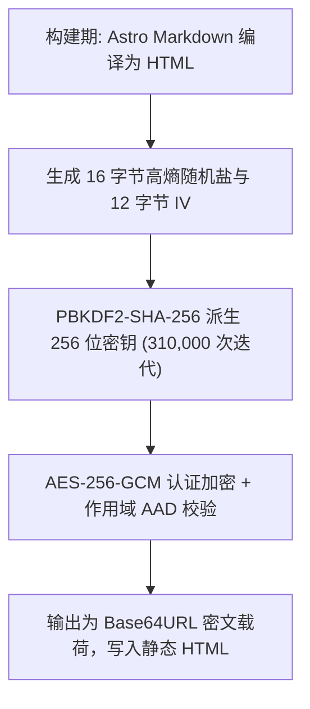
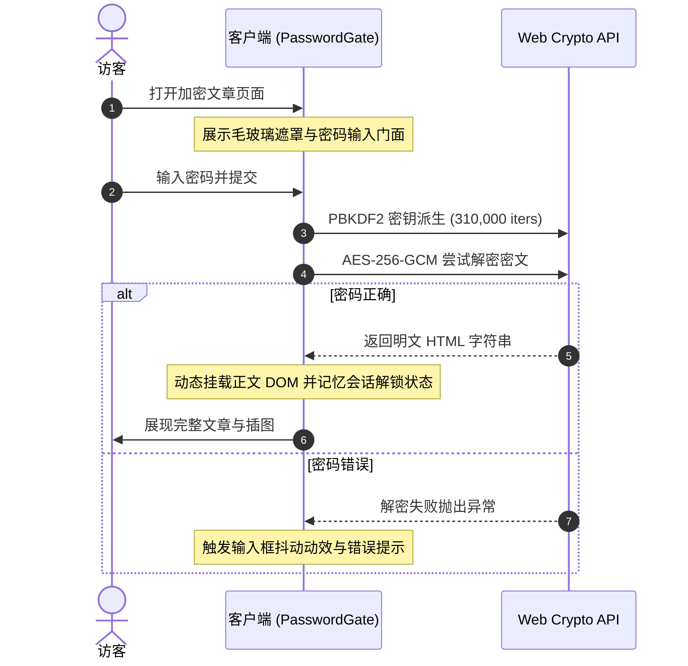

---
title: 文章客户端加密
createTime: 2026/09/01 02:20:00
permalink: /guide/writing/advanced/encryption/
---

Shirone 提供了基于现代浏览器标准 **Web Crypto API** 的文章客户端加密体系。在零后端服务器的纯静态博客架构下，为私密文章、个人日记与敏感技术笔记提供高强度的密码保护。

---

## 密码学标准与安全架构

Shirone 的加密机制完全基于现代工业级密码学规范实现：



- **认证加密算法**：**AES-256-GCM**。具备防篡改与完整性校验能力。
- **密钥派生函数**：**PBKDF2-SHA-256**，遵循 OWASP 安全标准采用 **310,000 次哈希迭代**，强力抵御离线彩虹表与 GPU 暴力破解。
- **作用域校验（AAD）**：加密载荷绑定专属作用域 `shirone-protected-content:1:${slug}`，防止跨文章密文重放攻击。
- **绝对零明文泄露**：静态构建产物中仅包含密文与公钥参数，**绝对不包含明文密码或明文正文**。

---

## 使用配置

在文章的 Frontmatter 中声明加密配置：

```markdown title="src/content/posts/my-encrypted-post.md"
---
title: 私密开发手记
published: 2026-09-01
description: 记录未公开项目的核心设计与架构方案。
category: 私密笔记
tags: [Security, Architecture]
image: ./cover.webp

# 核心加密配置
encrypted: true
password: "your-super-secret-password"
passwordHint: "我最喜欢的一部番剧名称"
hideHomeContent: true
---

# 这里是受保护的私密正文

恭喜你输入了正确的密码！这里的任何文本、代码块、数学公式与插图均已由客户端安全解密...
```

### 字段详解

| 字段 | 类型 | 必填 | 默认值 | 说明 |
| --- | --- | --- | --- | --- |
| `encrypted` | `boolean` | 否 | `false` | 显式标记文章为加密文章 |
| `password` | `string` | **是** | `""` | 文章解锁密码（支持中英文字符与特殊符号） |
| `passwordHint` | `string` | 否 | `""` | 密码提示信息，展示在密码输入框下方 |
| `hideHomeContent` | `boolean` | 否 | `false` | 是否在首页卡片中隐藏正文摘要（替换为安全提示文案） |

---

## 解锁与交互流程 (`PasswordGate`)

当访客访问加密页面时，浏览器的执行流程如下：



---

## 核心安全特性

### 1. 故障关闭原则（Fail-Closed Security）

如果某篇文章在 Frontmatter 中配置了 `encrypted: true`，但 `password` 字段为空或缺失，Shirone 的构建器会**立即中断并抛出严重错误**：

```text
Error: Encrypted posts require a non-empty password
```

这确保了不会因站长一时的配置疏忽，导致本应加密的私密内容被意外作为明文公开发布。

### 2. RSS 订阅流脱敏保护

Shirone 生成的 RSS / Atom Feed 会对加密文章自动执行安全脱敏：
- 标题自动添加 `🔒` 标识。
- 正文与摘要自动替换为安全占位提示：`这是一篇受密码保护的文章，请访问网页端输入密码查看。`
- 绝不向外部 RSS 聚合器暴露任何明文内容。

### 3. 会话解锁记忆

解密成功后，密码状态会在当前浏览器会话中安全保持。访客切页后再次返回该文章时无需重复输入密码，提升阅读连贯性。
