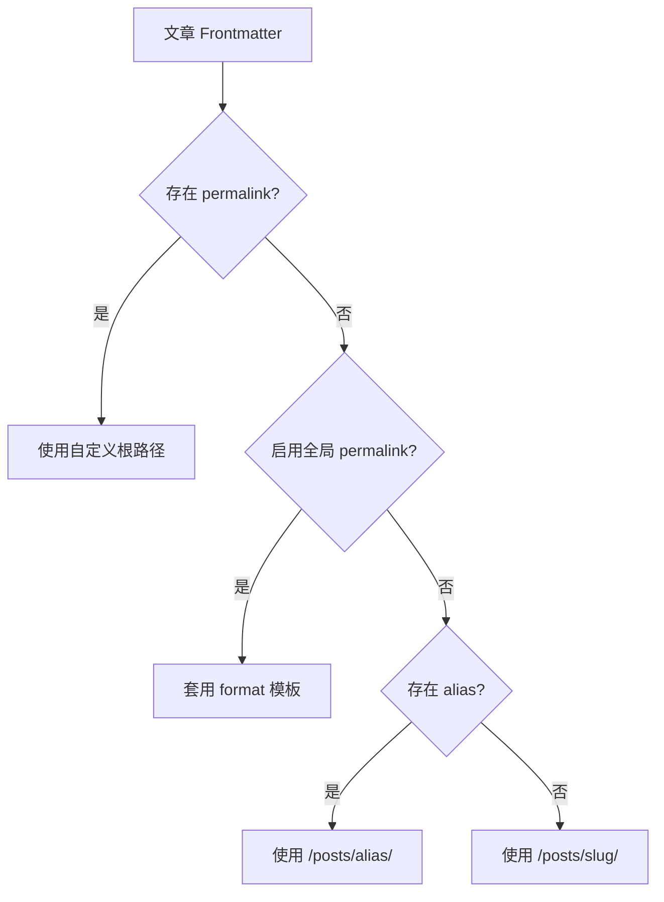

固定链接（Permalink）用于控制文章的公开访问地址。默认情况下，Shirone 使用文章文件名生成 `/posts/<slug>/` 路由；启用全局固定链接后，可通过模板按日期、分类或文章编号组织 URL，也可以为单篇文章指定一个完全自定义的地址。

---

## 配置全局固定链接 <Badge text="config/permalink.yaml" type="info" vertical="middle" />

在内容仓库中创建 `config/permalink.yaml`。该文件会以声明式覆盖的方式合并到主题默认配置，无需修改 `src/config/permalinkConfig.ts`。

```yaml title="config/permalink.yaml"
# 启用全局固定链接模板
enable: true

# 按发布日期生成文章地址
format: "%year%/%monthnum%/%day%/%postname%"
```

上例会将 `src/content/posts/hello-shirone.md` 生成为类似 `/2026/09/01/hello-shirone/` 的访问路径。

> [!TIP]
> **默认行为**
> `enable` 默认值为 `false`，`format` 默认值为 `%postname%`。未启用时，文章仍通过 `/posts/<slug>/` 访问；例如 `hello-shirone.md` 对应 `/posts/hello-shirone/`。

---

## 可用占位符

`format` 支持以下占位符。可自由组合连字符与 `/`，从而生成单层或多层路径。

| 占位符 | 含义 | 示例值 |
| --- | --- | --- |
| `%year%` | 四位发布年份 | `2026` |
| `%monthnum%` | 两位发布月份 | `09` |
| `%day%` | 两位发布日期 | `01` |
| `%hour%` | 两位发布时间（24 小时制） | `14` |
| `%minute%` | 两位发布分钟 | `30` |
| `%second%` | 两位发布秒数 | `00` |
| `%post_id%` | 文章数字编号 | `42` |
| `%postname%` | 文章 slug（不含扩展名） | `hello-shirone` |
| `%raw_postname%` | 原始文件名（保留大小写，不含扩展名） | `Hello-Shirone` |
| `%category%` | 文章分类 | `frontend` |

### 常用格式

```yaml title="config/permalink.yaml"
# /2026-09-hello-shirone/
format: "%year%-%monthnum%-%postname%"

# /42-hello-shirone/
format: "%post_id%-%postname%"

# /frontend/hello-shirone/
format: "%category%/%postname%"

# /2026/09/01/hello-shirone/
format: "%year%/%monthnum%/%day%/%postname%"
```

所有生成结果都会规范化为以 `/` 开头并以 `/` 结尾的站内路径。模板前后的多余斜杠也会在生成时移除。

---

## 为单篇文章指定地址 <Badge text="Frontmatter" type="info" vertical="middle" />

在文章 Frontmatter 中填写 `permalink`，即可为该文章指定 URL。此设置的优先级最高，无论全局固定链接是否启用，都会覆盖默认路由和全局模板。

```markdown title="src/content/posts/shirone-introduction.md"
---
title: Shirone 使用指南
published: 2026-09-01
category: documentation
permalink: /start-here/
---

文章正文...
```

该文章的访问地址为 `/start-here/`。`permalink` 两侧的 `/` 可省略；以下写法等价：

```yaml
permalink: start-here
```

### 迁移时保留既有地址

自定义固定链接适合将文章迁入 Shirone 时保留原有 URL，或在重命名文件后维持外部链接稳定：

```markdown
---
title: 新的文章标题
published: 2026-09-01
permalink: /blog/old-post-url/
---
```

文件名和标题可以继续调整，公开地址仍为 `/blog/old-post-url/`。

---

## 路由优先级与兼容行为

Shirone 按以下顺序解析文章链接：



- `permalink`：始终优先，生成根路径，如 `/start-here/`。
- 全局 `format`：仅在 `enable: true` 且文章未设置 `permalink` 时生效。
- `alias`：仅在全局固定链接关闭且未设置 `permalink` 时生效；其结果仍位于 `/posts/` 下。
- 默认 slug：来自文章 ID 或文件名，并会移除 `.md`、`.mdx`、`.markdown` 扩展名。

> [!WARNING]
> **避免路由冲突**
> 每篇已发布文章的最终路径必须唯一，也不要与站点现有静态页面重名。更改已发布文章的固定链接会改变公开 URL；上线前请为旧地址配置重定向，避免外部链接和搜索索引失效。

---

## 日期、时区与文章编号

日期占位符以文章的 `publishedAt` 为准；未提供 `publishedAt` 时使用 `published`。带具体时间的日期会按照 `siteConfig.timeZone` 配置的 IANA 时区解析。

当 `published` 仅为日期且时间为 UTC `00:00:00` 时，Shirone 将其视为纯日期，不会因时区换算而改变年月日。建议只需要日期的文章使用 `YYYY-MM-DD`，需要精确到时分秒的文章再设置 `publishedAt`。

`%post_id%` 由所有已发布文章按发布时间升序编号：最早发布的文章为 `1`；发布时间相同时按文章 ID 排序。草稿（`draft: true`）不参与编号。因此，若站点依赖文章编号作为长期 URL，发布更早的文章可能会影响后续编号，建议改用 `%postname%` 或为重要文章设置单篇 `permalink`。

没有 `category` 时，`%category%` 会替换为 `uncategorized`。

---

## 推荐策略

- **新站点**：使用 `%year%/%monthnum%/%day%/%postname%`，URL 直观且便于按时间归档。
- **长期技术文档**：使用 `%category%/%postname%`，不要把会频繁变化的日期或编号作为主要标识。
- **已运营站点迁移**：先为需要保留的旧链接逐篇配置 `permalink`，再为新文章启用统一模板。
- **需要稳定外链的内容**：优先使用单篇 `permalink`，并避免在发布后变更它。
