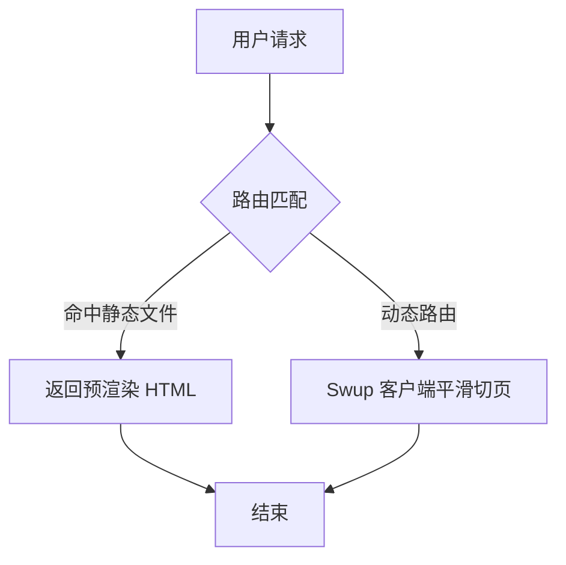
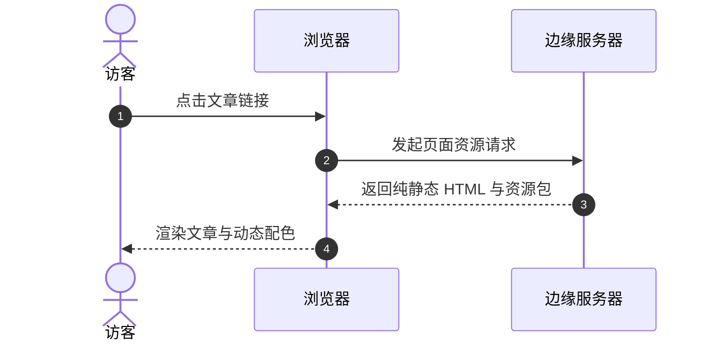
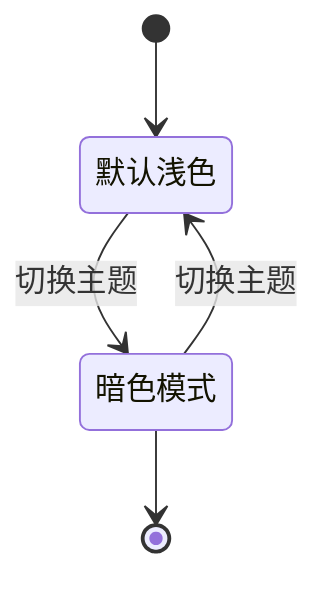

Shirone 原生集成了 Mermaid 图表渲染引擎，支持在 Markdown 中直接绘制流程图、时序图、甘特图、类图与状态图。

## 流程图（Flowchart）

````markdown

````

## 时序图（Sequence Diagram）

````markdown

````

## 状态图与架构图（State Diagram）

````markdown

````

## 核心特性

- **按需加载**：Mermaid 引擎仅在文章包含图表代码块时才会动态异步加载，不增加其他页面的初始打包体积。
- **色彩与主题同步**：图表线条、节点与文字颜色自动与当前站点的 Material 3 Expressive 主题色与明暗模式实时同步。
