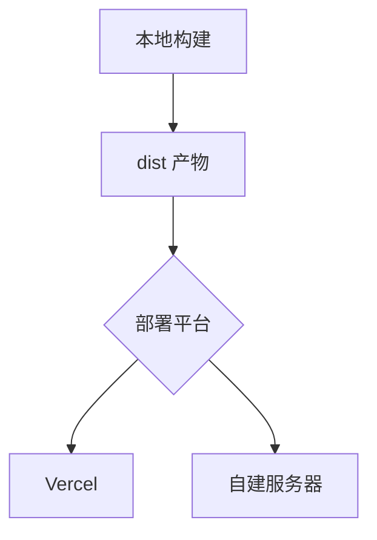

本篇讲解 Mermaid 图表、视频嵌入、音频朗读器与 GitHub 仓库卡片四类媒体能力。它们都在构建期生成回退标记、客户端按需增强，无内容时零资源加载。

## Mermaid 图表

用 `mermaid` 代码围栏书写，构建期保留可读源码、浏览器端增强为跟随主题配色的 SVG；主题切换与 Swup 站内导航后自动重渲染。

````markdown

````

支持全部主流图型：流程图（flowchart）、时序图（sequenceDiagram）、ER 图（erDiagram）、类图（classDiagram）、状态图（stateDiagram）、甘特图（gantt）、饼图（pie）、思维导图（mindmap）、时间线（timeline）、用户旅程（journey）、Git 图（gitGraph）、看板（kanban）、桑基图（sankey-beta）、XY 图（xychart-beta）。

::: tip 无障碍写法
在图内添加 `accTitle:` 与 `accDescr:` 两行为图表提供可访问名称与描述：

```text
flowchart TD
    accTitle: 文章发布流程
    accDescr: 文章经写作、校验、预览、构建后发布。
```

:::

## 视频嵌入

专用指令按需加载播放器，不写死 iframe：

```markdown
::youtube{id="5gIf0_xpFPI" title="YouTube 视频" preload="auto"}

::bilibili{bvid="BV1fK4y1s7Qf" title="B 站视频" p=1 preload="auto"}

::acfun{acid="ac48649632" title="AcFun 视频" preload="auto"}

::artplayer{src="https://example.com/video.mp4" title="直链视频" preload="auto"}
```

| 指令 | 参数 | 说明 |
| --- | --- | --- |
| `::youtube` | `id` | YouTube 视频 ID |
| `::bilibili` | `bvid`、`p` | B 站 BV 号与分 P 序号 |
| `::acfun` | `acid` | AcFun 视频 ID |
| `::artplayer` | `src` | 直链视频地址（本地或远程） |

通用参数：`title` 为可访问名称，`preload="auto"` 允许预载（默认点击才加载）。

也可以直接粘贴平台提供的 `<iframe>` 嵌入代码，但失去懒加载与主题适配。

## 音频朗读器（Audio Reader）

把短音频渲染为按需播放的朗读按钮，点击才加载资源：

```markdown
:audio-reader[朗读标题]{src="/assets/audio/filename.wav"}
```

- `src` 必须是站点根路径或 HTTPS URL
- 标签不能为空；非法指令保持普通 Markdown，不加载任何资源

## GitHub 仓库卡片

页面加载时从 GitHub API 拉取仓库信息并渲染卡片：

```markdown
::github{repo="LyraVoid/Shirone"}
```

格式为 `::github{repo="<owner>/<repo>"}`。注意这是运行时请求 GitHub API 的组件，离线环境或 API 限流时卡片降级显示。

## 嵌入示例：一篇图文并茂的教程

````markdown
---
title: 部署架构与演示
---

## 架构总览



## 视频演示

::bilibili{bvid="BV1fK4y1s7Qf" title="部署演示" p=1}

## 相关项目

::github{repo="LyraVoid/Shirone"}
````

## 常见问题

**Mermaid 图不渲染**

检查围栏语言是否为 `mermaid`、图型语法是否正确（Mermaid 语法错误时保留源码文本）。支持 `accTitle`/`accDescr` 无障碍注释。

**Bilibili 视频分 P 怎么指定**

`p` 参数指定分 P 序号，从 1 开始。

**GitHub 卡片一直转圈**

卡片依赖 GitHub API。确认网络可达、仓库存在（`owner/repo` 拼写正确）；API 匿名限流时稍后重试。

**音频自动播放吗**

不会。Audio Reader 刻意保持安静——只有读者按下按钮才加载并播放。
